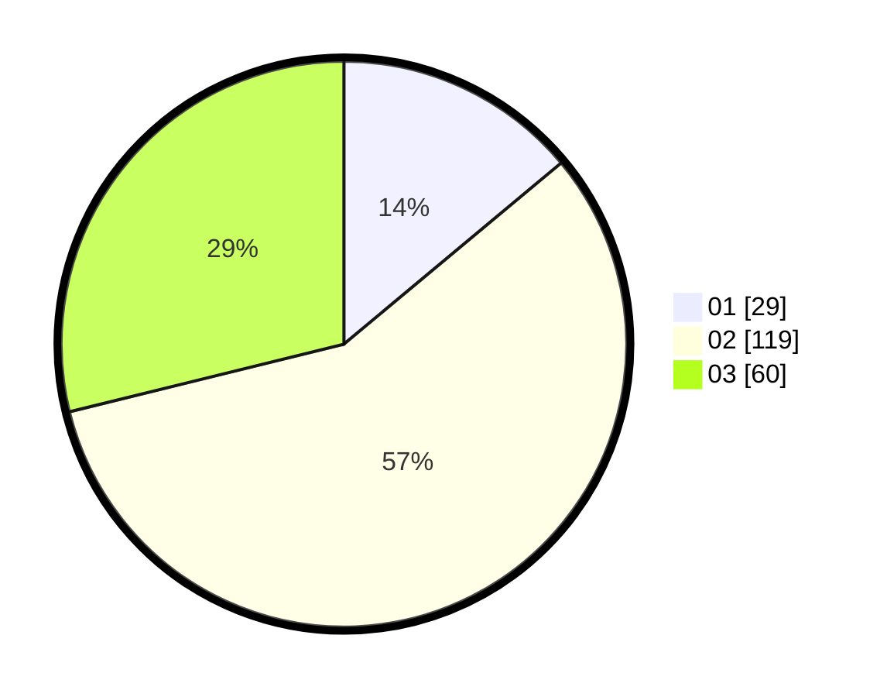

# Hasil

Hasil perolehan suara paslon dapat dilihat pada file paslon-01.txt, paslon-02.txt, dan paslon-03.txt.

Jika tidak ada, artinya data tersebut belum ada pada SIREKAP.

## Perolehan Suara

 * Paslon 01: **29**.
 * Paslon 02: **119**.
 * Paslon 03: **60**.

## Foto C Plano

https://sirekap-obj-formc.kpu.go.id/1126/pemilu/ppwp/31/73/01/10/06/3173011006180-20240215-213839--25f93838-6e72-4a7c-8e40-2651b390c4b7.jpg

https://sirekap-obj-formc.kpu.go.id/1126/pemilu/ppwp/31/73/01/10/06/3173011006180-20240215-213842--3be09d7b-e6ca-4f82-99b4-df85d431b3ff.jpg

https://sirekap-obj-formc.kpu.go.id/1126/pemilu/ppwp/31/73/01/10/06/3173011006180-20240215-213840--7badc885-2401-4ef1-a192-0b368f678829.jpg

## DATA PEMILIH TETAP

Jumlah pemilih dalam DPT: **275**.
 * L: **135**.
 * P: **140**.

## DATA PENGGUNA HAK PILIH

Jumlah pengguna hak pilih dalam DPT: **211**.
 * L: **98**.
 * P: **113**.

Jumlah pengguna hak pilih dalam DPTb: **0**.
 * L: **0**.
 * P: **0**.

Jumlah pengguna hak pilih dalam DPK: **0**.
 * L: **1**.
 * P: **0**.

Jumlah pengguna hak pilih: **212**.
 * L: **99**.
 * P: **113**.

## JUMLAH SUARA SAH DAN TIDAK SAH

JUMLAH SELURUH SUARA SAH: **208**.

JUMLAH SUARA TIDAK SAH: **4**.

JUMLAH SELURUH SUARA SAH DAN SUARA TIDAK SAH: **212**.
