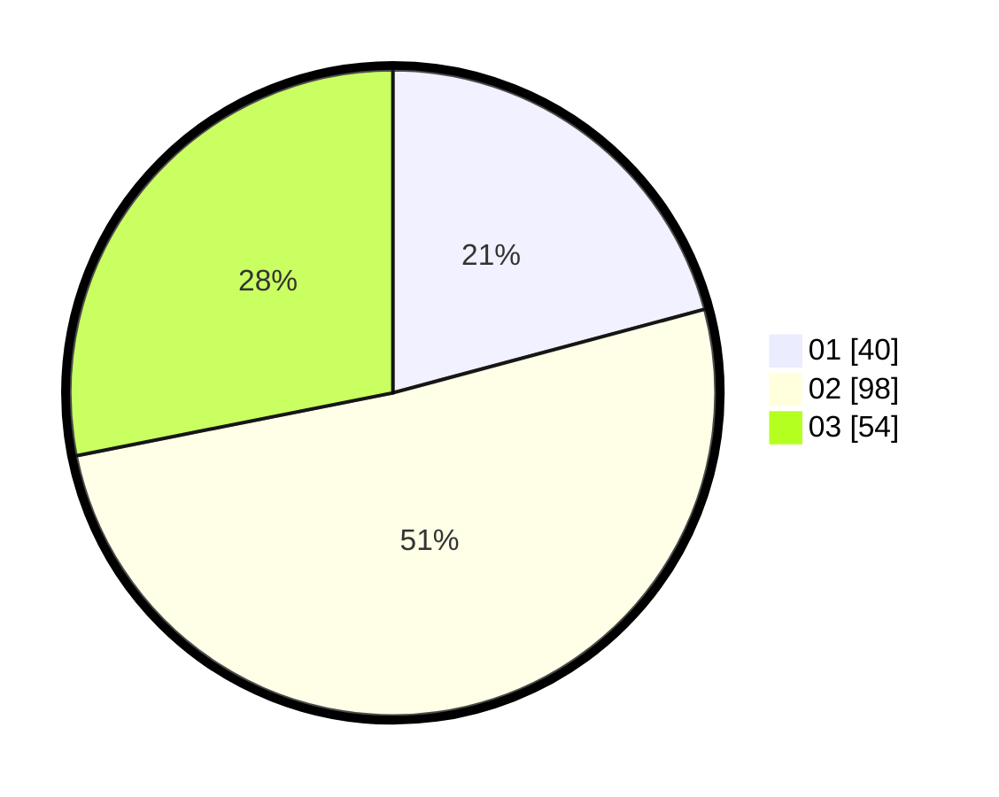

# Hasil

Hasil perolehan suara paslon dapat dilihat pada file paslon-01.txt, paslon-02.txt, dan paslon-03.txt.

Jika tidak ada, artinya data tersebut belum ada pada SIREKAP.

## Perolehan Suara

 * Paslon 01: **40**.
 * Paslon 02: **98**.
 * Paslon 03: **54**.

## Foto C Plano

https://sirekap-obj-formc.kpu.go.id/6def/pemilu/ppwp/31/73/01/10/06/3173011006181-20240215-220120--b413ab4d-65f3-42e1-9efb-47ac02738243.jpg

https://sirekap-obj-formc.kpu.go.id/6def/pemilu/ppwp/31/73/01/10/06/3173011006181-20240215-220127--a8a30635-7a32-4cd2-a8d5-9218baafab95.jpg

https://sirekap-obj-formc.kpu.go.id/6def/pemilu/ppwp/31/73/01/10/06/3173011006181-20240215-220122--76d454d2-19e9-4893-b90f-cffb1f6317cc.jpg

## DATA PEMILIH TETAP

Jumlah pemilih dalam DPT: **290**.
 * L: **148**.
 * P: **142**.

## DATA PENGGUNA HAK PILIH

Jumlah pengguna hak pilih dalam DPT: **195**.
 * L: **96**.
 * P: **99**.

Jumlah pengguna hak pilih dalam DPTb: **0**.
 * L: **0**.
 * P: **0**.

Jumlah pengguna hak pilih dalam DPK: **0**.
 * L: **0**.
 * P: **0**.

Jumlah pengguna hak pilih: **195**.
 * L: **96**.
 * P: **99**.

## JUMLAH SUARA SAH DAN TIDAK SAH

JUMLAH SELURUH SUARA SAH: **192**.

JUMLAH SUARA TIDAK SAH: **3**.

JUMLAH SELURUH SUARA SAH DAN SUARA TIDAK SAH: **195**.
