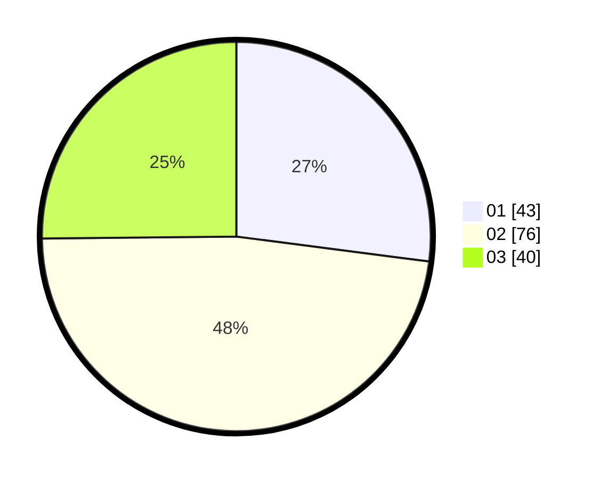

# Hasil

Hasil perolehan suara paslon dapat dilihat pada file paslon-01.txt, paslon-02.txt, dan paslon-03.txt.

Jika tidak ada, artinya data tersebut belum ada pada SIREKAP.

## Perolehan Suara

 * Paslon 01: **43**.
 * Paslon 02: **76**.
 * Paslon 03: **40**.

## Foto C Plano

https://sirekap-obj-formc.kpu.go.id/dab6/pemilu/ppwp/31/73/01/10/06/3173011006183-20240214-193607--9e19eb3d-bff8-4ee1-8503-8821e727645d.jpg

https://sirekap-obj-formc.kpu.go.id/dab6/pemilu/ppwp/31/73/01/10/06/3173011006183-20240216-022040--206d5272-79bd-414f-a285-da7858c69cdc.jpg

https://sirekap-obj-formc.kpu.go.id/dab6/pemilu/ppwp/31/73/01/10/06/3173011006183-20240214-194633--b7c4eaf5-455f-4f57-b8cd-9548ebe4e4fa.jpg

## DATA PEMILIH TETAP

Jumlah pemilih dalam DPT: **244**.
 * L: **114**.
 * P: **130**.

## DATA PENGGUNA HAK PILIH

Jumlah pengguna hak pilih dalam DPT: **162**.
 * L: **68**.
 * P: **94**.

Jumlah pengguna hak pilih dalam DPTb: **0**.
 * L: **0**.
 * P: **0**.

Jumlah pengguna hak pilih dalam DPK: **1**.
 * L: **1**.
 * P: **0**.

Jumlah pengguna hak pilih: **163**.
 * L: **69**.
 * P: **94**.

## JUMLAH SUARA SAH DAN TIDAK SAH

JUMLAH SELURUH SUARA SAH: **159**.

JUMLAH SUARA TIDAK SAH: **4**.

JUMLAH SELURUH SUARA SAH DAN SUARA TIDAK SAH: **163**.
