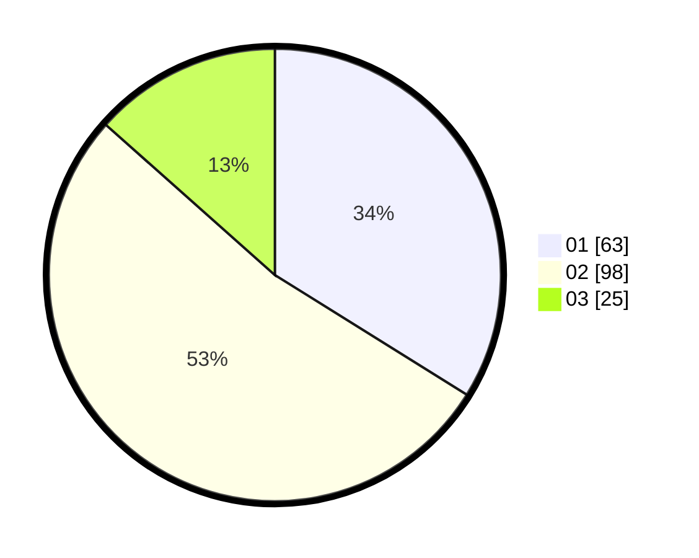

# Hasil

Hasil perolehan suara paslon dapat dilihat pada file paslon-01.txt, paslon-02.txt, dan paslon-03.txt.

Jika tidak ada, artinya data tersebut belum ada pada SIREKAP.

## Perolehan Suara

 * Paslon 01: **63**.
 * Paslon 02: **98**.
 * Paslon 03: **25**.

## Foto C Plano

https://sirekap-obj-formc.kpu.go.id/8d0d/pemilu/ppwp/31/73/01/10/06/3173011006184-20240216-135243--6bf44d87-8a5e-4499-8ddc-8c837c52edb7.jpg

https://sirekap-obj-formc.kpu.go.id/8d0d/pemilu/ppwp/31/73/01/10/06/3173011006184-20240216-135244--59086e08-8bcc-48e8-9958-8f64e3c956a3.jpg

https://sirekap-obj-formc.kpu.go.id/8d0d/pemilu/ppwp/31/73/01/10/06/3173011006184-20240216-135243--cc29269a-62af-4dbd-bd0e-f7c7758aa131.jpg

## DATA PEMILIH TETAP

Jumlah pemilih dalam DPT: **228**.
 * L: **111**.
 * P: **117**.

## DATA PENGGUNA HAK PILIH

Jumlah pengguna hak pilih dalam DPT: **188**.
 * L: **84**.
 * P: **104**.

Jumlah pengguna hak pilih dalam DPTb: **0**.
 * L: **0**.
 * P: **0**.

Jumlah pengguna hak pilih dalam DPK: **0**.
 * L: **0**.
 * P: **0**.

Jumlah pengguna hak pilih: **188**.
 * L: **84**.
 * P: **104**.

## JUMLAH SUARA SAH DAN TIDAK SAH

JUMLAH SELURUH SUARA SAH: **186**.

JUMLAH SUARA TIDAK SAH: **2**.

JUMLAH SELURUH SUARA SAH DAN SUARA TIDAK SAH: **188**.
