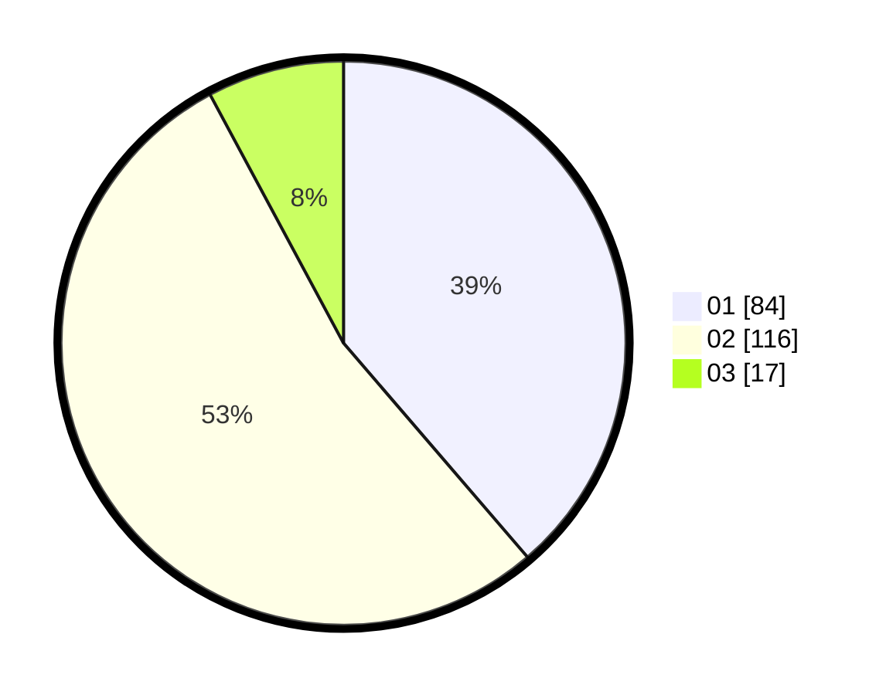

# Hasil

Hasil perolehan suara paslon dapat dilihat pada file paslon-01.txt, paslon-02.txt, dan paslon-03.txt.

Jika tidak ada, artinya data tersebut belum ada pada SIREKAP.

## Perolehan Suara

 * Paslon 01: **84**.
 * Paslon 02: **116**.
 * Paslon 03: **17**.

## Foto C Plano

https://sirekap-obj-formc.kpu.go.id/58d6/pemilu/ppwp/31/73/01/10/06/3173011006185-20240216-124208--973f5df7-dad0-481b-93f5-c3c6ea23ab7a.jpg

https://sirekap-obj-formc.kpu.go.id/58d6/pemilu/ppwp/31/73/01/10/06/3173011006185-20240216-124212--ae222fc8-c0ee-44b4-9836-7bf0fa3267a6.jpg

https://sirekap-obj-formc.kpu.go.id/58d6/pemilu/ppwp/31/73/01/10/06/3173011006185-20240216-124209--99190684-d333-4dff-9643-1e0e569c3a4e.jpg

## DATA PEMILIH TETAP

Jumlah pemilih dalam DPT: **294**.
 * L: **143**.
 * P: **151**.

## DATA PENGGUNA HAK PILIH

Jumlah pengguna hak pilih dalam DPT: **220**.
 * L: **101**.
 * P: **119**.

Jumlah pengguna hak pilih dalam DPTb: **0**.
 * L: **0**.
 * P: **0**.

Jumlah pengguna hak pilih dalam DPK: **0**.
 * L: **0**.
 * P: **0**.

Jumlah pengguna hak pilih: **220**.
 * L: **101**.
 * P: **119**.

## JUMLAH SUARA SAH DAN TIDAK SAH

JUMLAH SELURUH SUARA SAH: **217**.

JUMLAH SUARA TIDAK SAH: **3**.

JUMLAH SELURUH SUARA SAH DAN SUARA TIDAK SAH: **220**.
