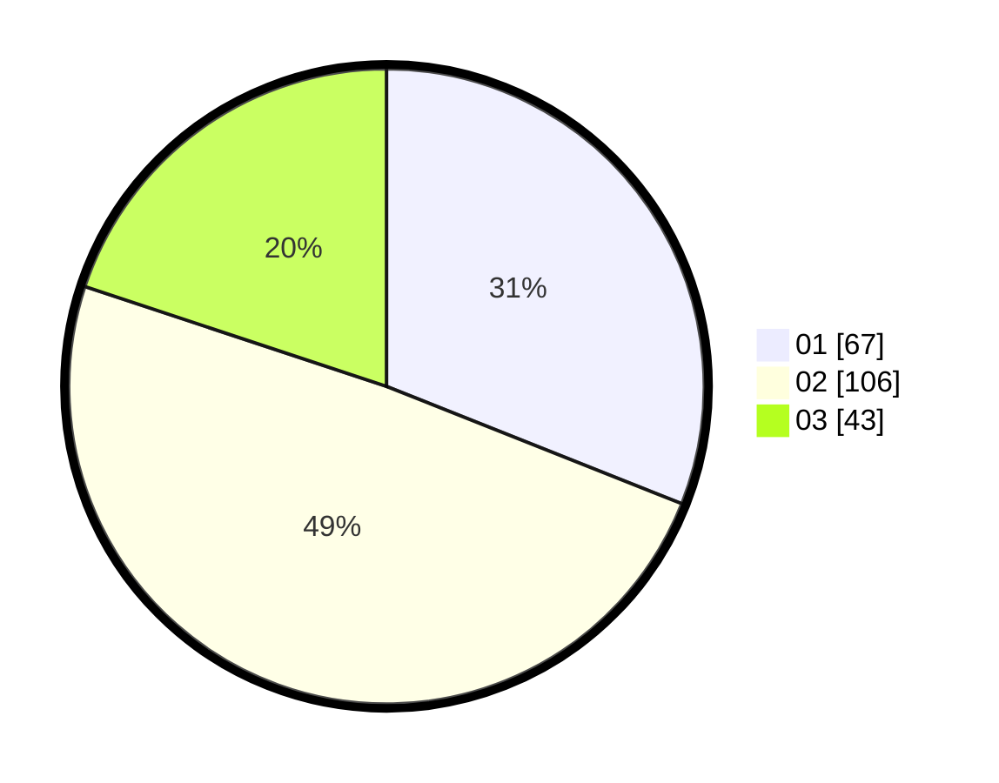

# Hasil

Hasil perolehan suara paslon dapat dilihat pada file paslon-01.txt, paslon-02.txt, dan paslon-03.txt.

Jika tidak ada, artinya data tersebut belum ada pada SIREKAP.

## Perolehan Suara

 * Paslon 01: **67**.
 * Paslon 02: **106**.
 * Paslon 03: **43**.

## Foto C Plano

https://sirekap-obj-formc.kpu.go.id/752a/pemilu/ppwp/31/73/01/10/06/3173011006186-20240214-224756--7efda43b-18ac-4f6a-9a26-f4731b86265e.jpg

https://sirekap-obj-formc.kpu.go.id/752a/pemilu/ppwp/31/73/01/10/06/3173011006186-20240216-072815--84618948-d397-4206-8c5c-a058d17a34f4.jpg

https://sirekap-obj-formc.kpu.go.id/752a/pemilu/ppwp/31/73/01/10/06/3173011006186-20240216-072813--c1941bcb-6e5f-49d4-8a4f-53fb615cce41.jpg

## DATA PEMILIH TETAP

Jumlah pemilih dalam DPT: **295**.
 * L: **139**.
 * P: **156**.

## DATA PENGGUNA HAK PILIH

Jumlah pengguna hak pilih dalam DPT: **214**.
 * L: **99**.
 * P: **115**.

Jumlah pengguna hak pilih dalam DPTb: **5**.
 * L: **1**.
 * P: **4**.

Jumlah pengguna hak pilih dalam DPK: **0**.
 * L: **0**.
 * P: **0**.

Jumlah pengguna hak pilih: **219**.
 * L: **100**.
 * P: **119**.

## JUMLAH SUARA SAH DAN TIDAK SAH

JUMLAH SELURUH SUARA SAH: **216**.

JUMLAH SUARA TIDAK SAH: **3**.

JUMLAH SELURUH SUARA SAH DAN SUARA TIDAK SAH: **219**.
