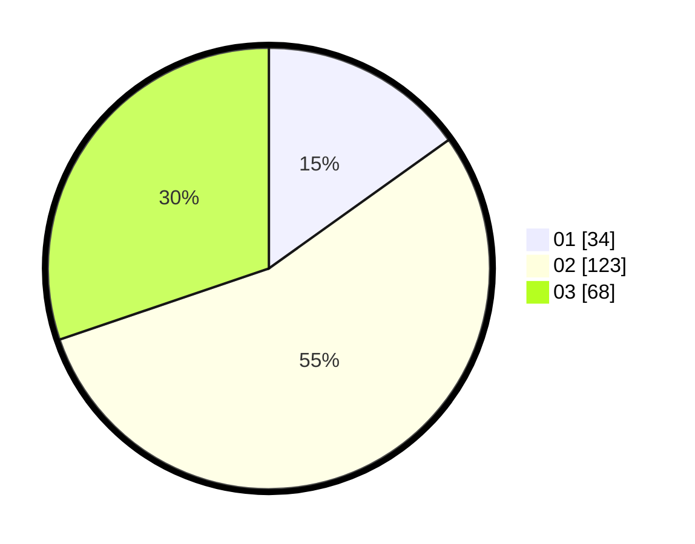

# Hasil

Hasil perolehan suara paslon dapat dilihat pada file paslon-01.txt, paslon-02.txt, dan paslon-03.txt.

Jika tidak ada, artinya data tersebut belum ada pada SIREKAP.

## Perolehan Suara

 * Paslon 01: **34**.
 * Paslon 02: **123**.
 * Paslon 03: **68**.

## Foto C Plano

https://sirekap-obj-formc.kpu.go.id/f37b/pemilu/ppwp/31/73/01/10/06/3173011006187-20240216-154022--2229e9aa-87c4-462f-939a-34be22497680.jpg

https://sirekap-obj-formc.kpu.go.id/f37b/pemilu/ppwp/31/73/01/10/06/3173011006187-20240216-154024--a793b192-24a0-4aa6-b9ef-775890526593.jpg

https://sirekap-obj-formc.kpu.go.id/f37b/pemilu/ppwp/31/73/01/10/06/3173011006187-20240216-154023--3626493e-36c2-4a76-bb82-d485cb8e77d1.jpg

## DATA PEMILIH TETAP

Jumlah pemilih dalam DPT: **296**.
 * L: **150**.
 * P: **146**.

## DATA PENGGUNA HAK PILIH

Jumlah pengguna hak pilih dalam DPT: **218**.
 * L: **106**.
 * P: **112**.

Jumlah pengguna hak pilih dalam DPTb: **6**.
 * L: **1**.
 * P: **5**.

Jumlah pengguna hak pilih dalam DPK: **0**.
 * L: **0**.
 * P: **0**.

Jumlah pengguna hak pilih: **224**.
 * L: **107**.
 * P: **117**.

## JUMLAH SUARA SAH DAN TIDAK SAH

JUMLAH SELURUH SUARA SAH: **225**.

JUMLAH SUARA TIDAK SAH: **0**.

JUMLAH SELURUH SUARA SAH DAN SUARA TIDAK SAH: **225**.
