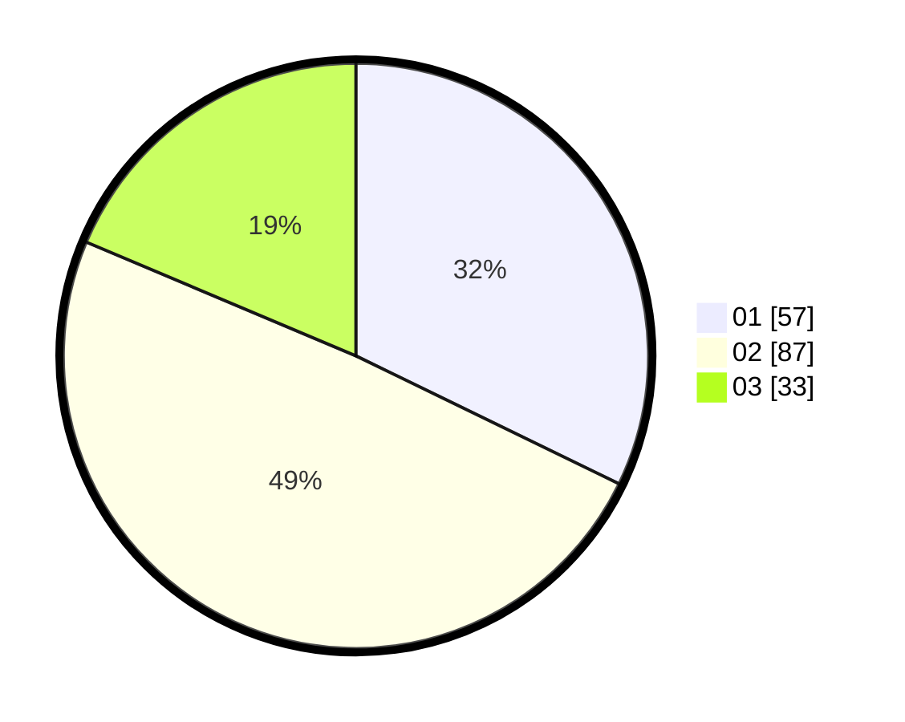

# Hasil

Hasil perolehan suara paslon dapat dilihat pada file paslon-01.txt, paslon-02.txt, dan paslon-03.txt.

Jika tidak ada, artinya data tersebut belum ada pada SIREKAP.

## Perolehan Suara

 * Paslon 01: **57**.
 * Paslon 02: **87**.
 * Paslon 03: **33**.

## Foto C Plano

https://sirekap-obj-formc.kpu.go.id/1df4/pemilu/ppwp/31/73/01/10/06/3173011006189-20240216-003240--6b967b97-d76d-4fe3-8f66-3e7695692166.jpg

https://sirekap-obj-formc.kpu.go.id/1df4/pemilu/ppwp/31/73/01/10/06/3173011006189-20240216-003242--454d4e6d-fb1f-4060-bc60-2674dce1dc97.jpg

https://sirekap-obj-formc.kpu.go.id/1df4/pemilu/ppwp/31/73/01/10/06/3173011006189-20240216-003241--d53da9a1-49f7-4da4-a6f2-87431294c9fb.jpg

## DATA PEMILIH TETAP

Jumlah pemilih dalam DPT: **201**.
 * L: **102**.
 * P: **99**.

## DATA PENGGUNA HAK PILIH

Jumlah pengguna hak pilih dalam DPT: **168**.
 * L: **83**.
 * P: **85**.

Jumlah pengguna hak pilih dalam DPTb: **10**.
 * L: **9**.
 * P: **1**.

Jumlah pengguna hak pilih dalam DPK: **0**.
 * L: **0**.
 * P: **0**.

Jumlah pengguna hak pilih: **178**.
 * L: **92**.
 * P: **86**.

## JUMLAH SUARA SAH DAN TIDAK SAH

JUMLAH SELURUH SUARA SAH: **177**.

JUMLAH SUARA TIDAK SAH: **1**.

JUMLAH SELURUH SUARA SAH DAN SUARA TIDAK SAH: **178**.
