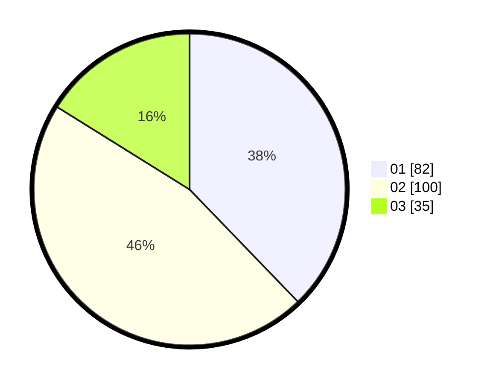

# Hasil

Hasil perolehan suara paslon dapat dilihat pada file paslon-01.txt, paslon-02.txt, dan paslon-03.txt.

Jika tidak ada, artinya data tersebut belum ada pada SIREKAP.

## Perolehan Suara

 * Paslon 01: **82**.
 * Paslon 02: **100**.
 * Paslon 03: **35**.

## Foto C Plano

https://sirekap-obj-formc.kpu.go.id/e134/pemilu/ppwp/31/73/01/10/06/3173011006193-20240215-225805--9595c6ec-f3e5-47e0-b660-3cc7ed31a93d.jpg

https://sirekap-obj-formc.kpu.go.id/e134/pemilu/ppwp/31/73/01/10/06/3173011006193-20240215-225807--abfaed82-ac86-40a2-babf-b244b3820c86.jpg

https://sirekap-obj-formc.kpu.go.id/e134/pemilu/ppwp/31/73/01/10/06/3173011006193-20240215-225806--e694bab8-fc37-41ce-9052-f9e6751eb5b3.jpg

## DATA PEMILIH TETAP

Jumlah pemilih dalam DPT: **289**.
 * L: **148**.
 * P: **141**.

## DATA PENGGUNA HAK PILIH

Jumlah pengguna hak pilih dalam DPT: **223**.
 * L: **113**.
 * P: **110**.

Jumlah pengguna hak pilih dalam DPTb: **0**.
 * L: **0**.
 * P: **0**.

Jumlah pengguna hak pilih dalam DPK: **0**.
 * L: **0**.
 * P: **0**.

Jumlah pengguna hak pilih: **223**.
 * L: **113**.
 * P: **110**.

## JUMLAH SUARA SAH DAN TIDAK SAH

JUMLAH SELURUH SUARA SAH: **217**.

JUMLAH SUARA TIDAK SAH: **6**.

JUMLAH SELURUH SUARA SAH DAN SUARA TIDAK SAH: **223**.
