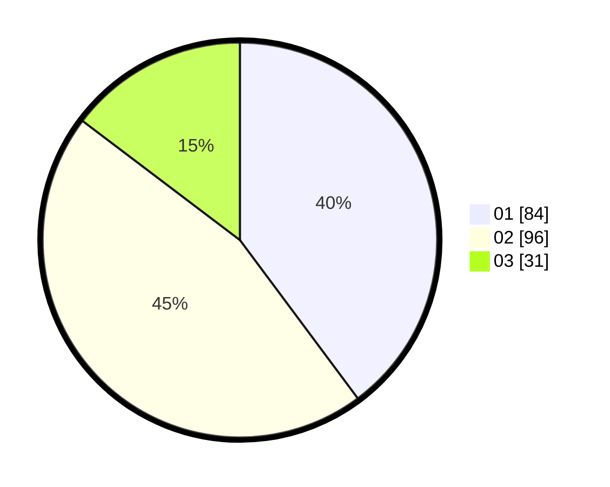

# Hasil

Hasil perolehan suara paslon dapat dilihat pada file paslon-01.txt, paslon-02.txt, dan paslon-03.txt.

Jika tidak ada, artinya data tersebut belum ada pada SIREKAP.

## Perolehan Suara

 * Paslon 01: **84**.
 * Paslon 02: **96**.
 * Paslon 03: **31**.

## Foto C Plano

https://sirekap-obj-formc.kpu.go.id/844d/pemilu/ppwp/31/73/01/10/06/3173011006199-20240216-033842--5d536097-96ee-4789-83d5-a309a52fbcce.jpg

https://sirekap-obj-formc.kpu.go.id/844d/pemilu/ppwp/31/73/01/10/06/3173011006199-20240216-033843--31d4f3c3-063e-48e2-bba5-57b521035b6f.jpg

https://sirekap-obj-formc.kpu.go.id/844d/pemilu/ppwp/31/73/01/10/06/3173011006199-20240216-033842--ed90d3cc-fa8c-44f3-83c5-564118e9bbbc.jpg

## DATA PEMILIH TETAP

Jumlah pemilih dalam DPT: **0**.
 * L: **0**.
 * P: **0**.

## DATA PENGGUNA HAK PILIH

Jumlah pengguna hak pilih dalam DPT: **0**.
 * L: **0**.
 * P: **0**.

Jumlah pengguna hak pilih dalam DPTb: **0**.
 * L: **0**.
 * P: **0**.

Jumlah pengguna hak pilih dalam DPK: **0**.
 * L: **0**.
 * P: **0**.

Jumlah pengguna hak pilih: **0**.
 * L: **0**.
 * P: **0**.

## JUMLAH SUARA SAH DAN TIDAK SAH

JUMLAH SELURUH SUARA SAH: **211**.

JUMLAH SUARA TIDAK SAH: **2**.

JUMLAH SELURUH SUARA SAH DAN SUARA TIDAK SAH: **213**.
