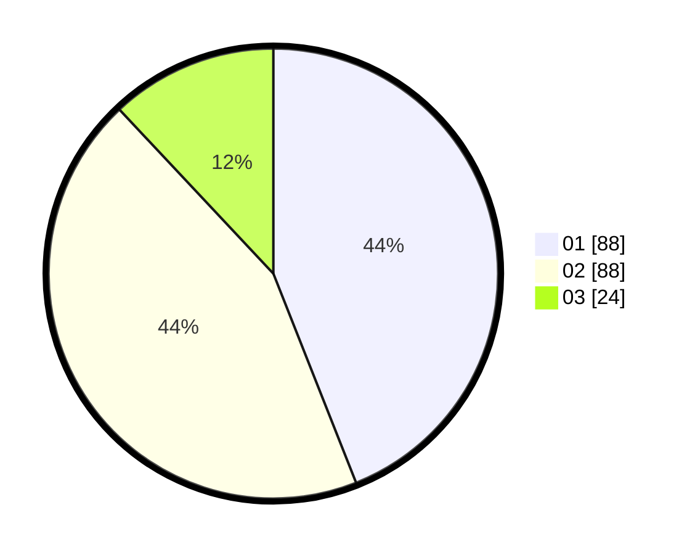

# Hasil

Hasil perolehan suara paslon dapat dilihat pada file paslon-01.txt, paslon-02.txt, dan paslon-03.txt.

Jika tidak ada, artinya data tersebut belum ada pada SIREKAP.

## Perolehan Suara

 * Paslon 01: **88**.
 * Paslon 02: **88**.
 * Paslon 03: **24**.

## Foto C Plano

https://sirekap-obj-formc.kpu.go.id/7fca/pemilu/ppwp/31/73/01/10/06/3173011006202-20240215-211447--7f4d1764-0e28-4e23-94f5-b6c1330217c7.jpg

https://sirekap-obj-formc.kpu.go.id/7fca/pemilu/ppwp/31/73/01/10/06/3173011006202-20240215-211449--47531f15-c7e0-4688-9c3b-d8911c331afa.jpg

https://sirekap-obj-formc.kpu.go.id/7fca/pemilu/ppwp/31/73/01/10/06/3173011006202-20240215-211448--1fe29be7-60e1-450f-aa56-d3ef39e35800.jpg

## DATA PEMILIH TETAP

Jumlah pemilih dalam DPT: **267**.
 * L: **129**.
 * P: **138**.

## DATA PENGGUNA HAK PILIH

Jumlah pengguna hak pilih dalam DPT: **197**.
 * L: **89**.
 * P: **108**.

Jumlah pengguna hak pilih dalam DPTb: **0**.
 * L: **0**.
 * P: **0**.

Jumlah pengguna hak pilih dalam DPK: **3**.
 * L: **2**.
 * P: **1**.

Jumlah pengguna hak pilih: **200**.
 * L: **91**.
 * P: **109**.

## JUMLAH SUARA SAH DAN TIDAK SAH

JUMLAH SELURUH SUARA SAH: **200**.

JUMLAH SUARA TIDAK SAH: **0**.

JUMLAH SELURUH SUARA SAH DAN SUARA TIDAK SAH: **200**.
