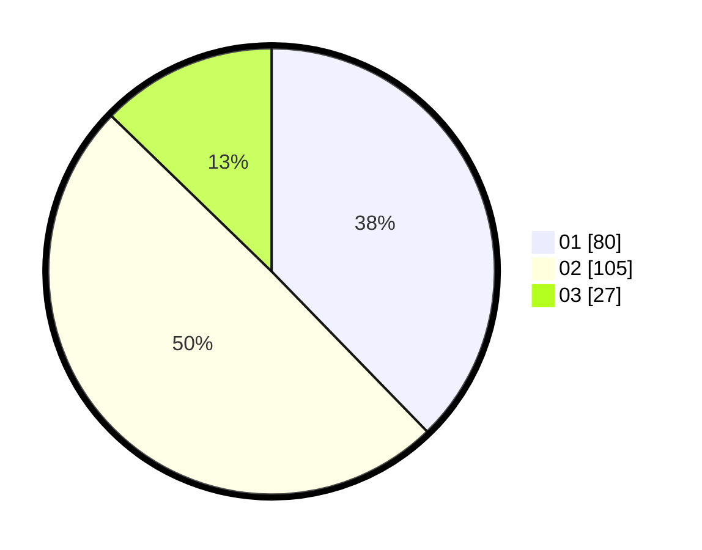

# Hasil

Hasil perolehan suara paslon dapat dilihat pada file paslon-01.txt, paslon-02.txt, dan paslon-03.txt.

Jika tidak ada, artinya data tersebut belum ada pada SIREKAP.

## Perolehan Suara

 * Paslon 01: **80**.
 * Paslon 02: **105**.
 * Paslon 03: **27**.

## Foto C Plano

https://sirekap-obj-formc.kpu.go.id/fae6/pemilu/ppwp/31/73/01/10/06/3173011006204-20240214-223042--5cb3d0d3-db05-4f85-be97-3a3117df5503.jpg

https://sirekap-obj-formc.kpu.go.id/fae6/pemilu/ppwp/31/73/01/10/06/3173011006204-20240214-223057--fdd3bad1-fc3d-4978-b06d-7b796b68f958.jpg

https://sirekap-obj-formc.kpu.go.id/fae6/pemilu/ppwp/31/73/01/10/06/3173011006204-20240214-223103--532326cc-8b45-49b8-8eb8-aea3a39bc580.jpg
