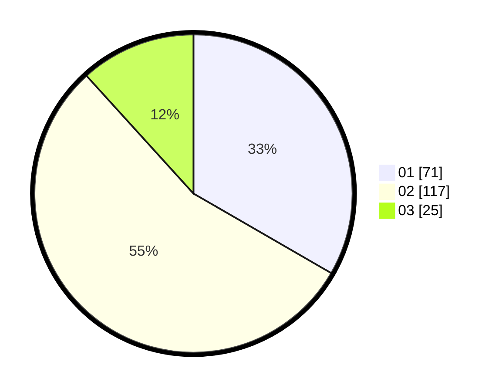

# Hasil

Hasil perolehan suara paslon dapat dilihat pada file paslon-01.txt, paslon-02.txt, dan paslon-03.txt.

Jika tidak ada, artinya data tersebut belum ada pada SIREKAP.

## Perolehan Suara

 * Paslon 01: **71**.
 * Paslon 02: **117**.
 * Paslon 03: **25**.

## Foto C Plano

https://sirekap-obj-formc.kpu.go.id/d9a3/pemilu/ppwp/31/73/01/10/06/3173011006206-20240215-205807--1c60040f-d9e9-423b-9f54-eabe06c0d303.jpg

https://sirekap-obj-formc.kpu.go.id/d9a3/pemilu/ppwp/31/73/01/10/06/3173011006206-20240215-205809--659a57d4-d220-4d1b-b7d2-62260fe7695a.jpg

https://sirekap-obj-formc.kpu.go.id/d9a3/pemilu/ppwp/31/73/01/10/06/3173011006206-20240215-205808--497d4d4a-4cb2-4c2b-aa7e-21e16cc8d277.jpg

## DATA PEMILIH TETAP

Jumlah pemilih dalam DPT: **276**.
 * L: **140**.
 * P: **136**.

## DATA PENGGUNA HAK PILIH

Jumlah pengguna hak pilih dalam DPT: **218**.
 * L: **113**.
 * P: **105**.

Jumlah pengguna hak pilih dalam DPTb: **1**.
 * L: **1**.
 * P: **0**.

Jumlah pengguna hak pilih dalam DPK: **5**.
 * L: **3**.
 * P: **2**.

Jumlah pengguna hak pilih: **224**.
 * L: **117**.
 * P: **107**.

## JUMLAH SUARA SAH DAN TIDAK SAH

JUMLAH SELURUH SUARA SAH: **213**.

JUMLAH SUARA TIDAK SAH: **5**.

JUMLAH SELURUH SUARA SAH DAN SUARA TIDAK SAH: **218**.
