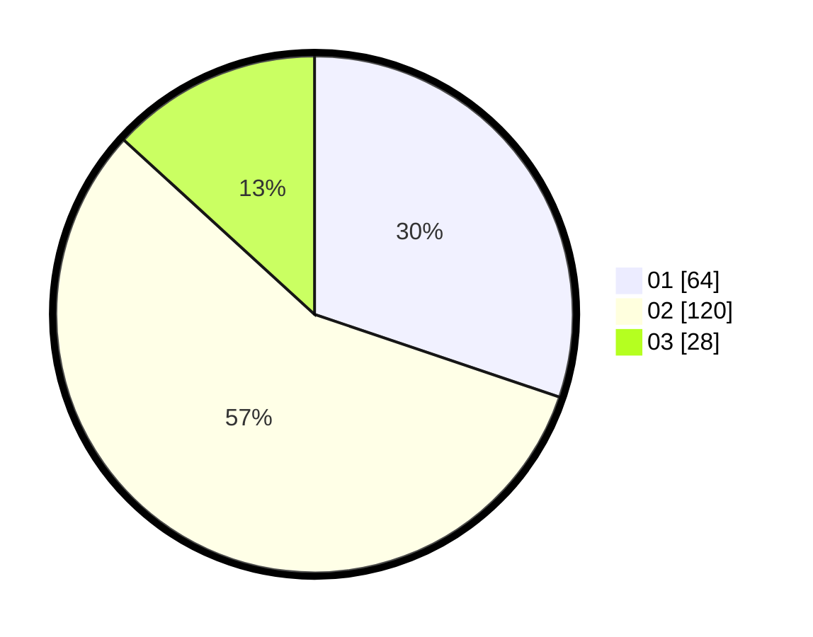

# Hasil

Hasil perolehan suara paslon dapat dilihat pada file paslon-01.txt, paslon-02.txt, dan paslon-03.txt.

Jika tidak ada, artinya data tersebut belum ada pada SIREKAP.

## Perolehan Suara

 * Paslon 01: **64**.
 * Paslon 02: **120**.
 * Paslon 03: **28**.

## Foto C Plano

https://sirekap-obj-formc.kpu.go.id/e54a/pemilu/ppwp/31/73/01/10/06/3173011006207-20240215-222722--3d6923c5-c29f-43ee-bfd5-672821738172.jpg

https://sirekap-obj-formc.kpu.go.id/e54a/pemilu/ppwp/31/73/01/10/06/3173011006207-20240215-222724--2b8bb879-0cef-497f-8d76-265a6bc0230e.jpg

https://sirekap-obj-formc.kpu.go.id/e54a/pemilu/ppwp/31/73/01/10/06/3173011006207-20240215-222723--1b37cecf-79d9-41a7-ab34-333ab56b062f.jpg

## DATA PEMILIH TETAP

Jumlah pemilih dalam DPT: **283**.
 * L: **142**.
 * P: **141**.

## DATA PENGGUNA HAK PILIH

Jumlah pengguna hak pilih dalam DPT: **216**.
 * L: **105**.
 * P: **111**.

Jumlah pengguna hak pilih dalam DPTb: **0**.
 * L: **0**.
 * P: **0**.

Jumlah pengguna hak pilih dalam DPK: **0**.
 * L: **0**.
 * P: **0**.

Jumlah pengguna hak pilih: **216**.
 * L: **105**.
 * P: **111**.

## JUMLAH SUARA SAH DAN TIDAK SAH

JUMLAH SELURUH SUARA SAH: **212**.

JUMLAH SUARA TIDAK SAH: **4**.

JUMLAH SELURUH SUARA SAH DAN SUARA TIDAK SAH: **216**.
