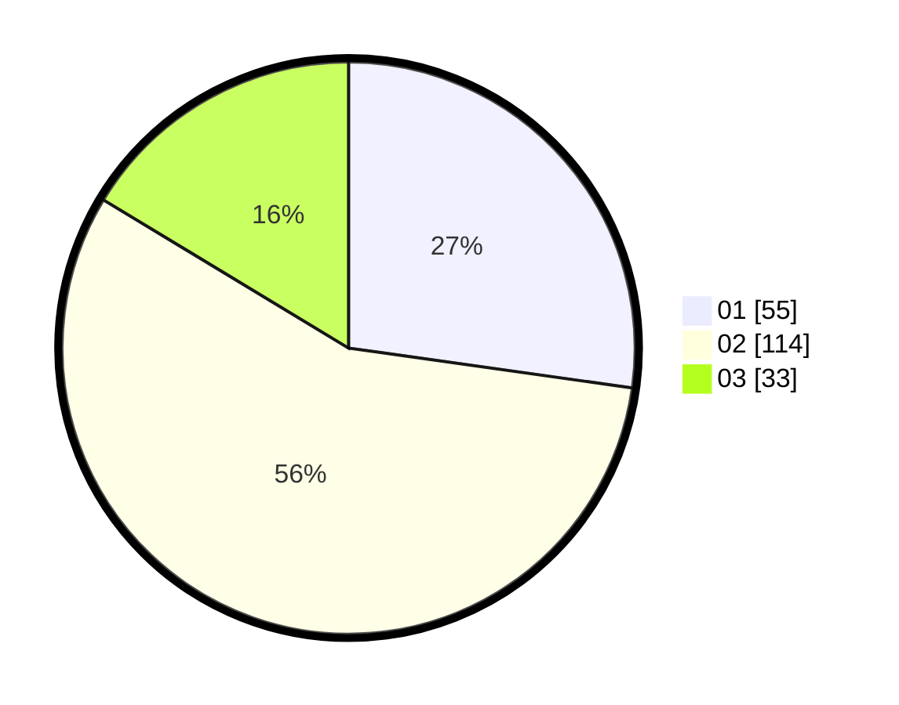

# Hasil

Hasil perolehan suara paslon dapat dilihat pada file paslon-01.txt, paslon-02.txt, dan paslon-03.txt.

Jika tidak ada, artinya data tersebut belum ada pada SIREKAP.

## Perolehan Suara

 * Paslon 01: **55**.
 * Paslon 02: **114**.
 * Paslon 03: **33**.

## Foto C Plano

https://sirekap-obj-formc.kpu.go.id/cb3f/pemilu/ppwp/31/73/01/10/06/3173011006209-20240215-001812--bc023d77-4425-400d-839b-424bc329018c.jpg

https://sirekap-obj-formc.kpu.go.id/cb3f/pemilu/ppwp/31/73/01/10/06/3173011006209-20240215-001919--a6f61009-621b-4988-aa2e-e084a12ef668.jpg

https://sirekap-obj-formc.kpu.go.id/cb3f/pemilu/ppwp/31/73/01/10/06/3173011006209-20240215-002003--baf07de1-72dc-4cf4-be46-7ee90cca9c89.jpg
