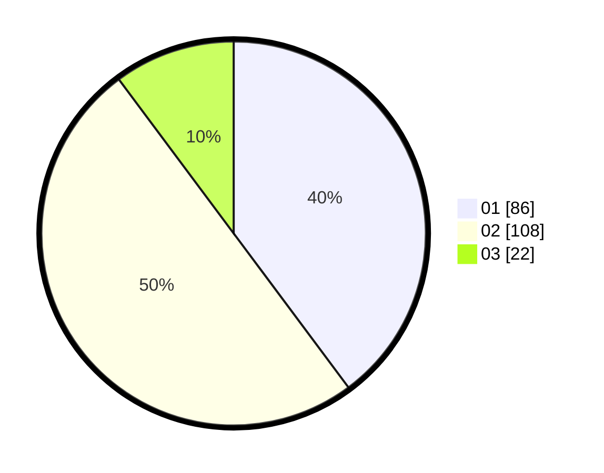

# Hasil

Hasil perolehan suara paslon dapat dilihat pada file paslon-01.txt, paslon-02.txt, dan paslon-03.txt.

Jika tidak ada, artinya data tersebut belum ada pada SIREKAP.

## Perolehan Suara

 * Paslon 01: **86**.
 * Paslon 02: **108**.
 * Paslon 03: **22**.

## Foto C Plano

https://sirekap-obj-formc.kpu.go.id/91ab/pemilu/ppwp/31/73/01/10/06/3173011006216-20240216-001659--b4ee8f6c-7fcb-4add-8fff-d0de7581ca51.jpg

https://sirekap-obj-formc.kpu.go.id/91ab/pemilu/ppwp/31/73/01/10/06/3173011006216-20240216-001701--7f4b4f76-9d44-415f-a98a-e92885936b8f.jpg

https://sirekap-obj-formc.kpu.go.id/91ab/pemilu/ppwp/31/73/01/10/06/3173011006216-20240216-001700--a0ce6680-5617-491f-b55e-43bd33d69093.jpg

## DATA PEMILIH TETAP

Jumlah pemilih dalam DPT: **297**.
 * L: **157**.
 * P: **140**.

## DATA PENGGUNA HAK PILIH

Jumlah pengguna hak pilih dalam DPT: **219**.
 * L: **115**.
 * P: **104**.

Jumlah pengguna hak pilih dalam DPTb: **0**.
 * L: **0**.
 * P: **0**.

Jumlah pengguna hak pilih dalam DPK: **0**.
 * L: **0**.
 * P: **0**.

Jumlah pengguna hak pilih: **219**.
 * L: **115**.
 * P: **104**.

## JUMLAH SUARA SAH DAN TIDAK SAH

JUMLAH SELURUH SUARA SAH: **216**.

JUMLAH SUARA TIDAK SAH: **3**.

JUMLAH SELURUH SUARA SAH DAN SUARA TIDAK SAH: **219**.
