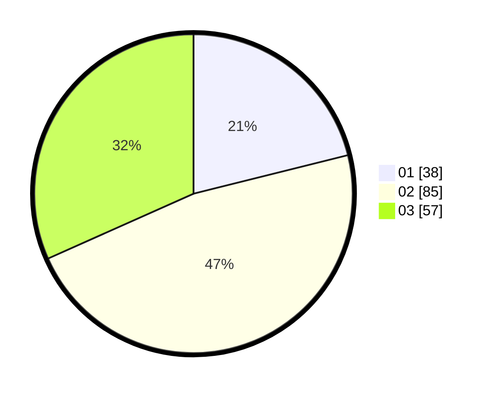

# Hasil

Hasil perolehan suara paslon dapat dilihat pada file paslon-01.txt, paslon-02.txt, dan paslon-03.txt.

Jika tidak ada, artinya data tersebut belum ada pada SIREKAP.

## Perolehan Suara

 * Paslon 01: **38**.
 * Paslon 02: **85**.
 * Paslon 03: **57**.

## Foto C Plano

https://sirekap-obj-formc.kpu.go.id/8783/pemilu/ppwp/31/73/01/10/06/3173011006219-20240214-235751--0352465d-5a5c-4229-b678-22569d5a9f9a.jpg

https://sirekap-obj-formc.kpu.go.id/8783/pemilu/ppwp/31/73/01/10/06/3173011006219-20240214-185018--de48612d-ee7f-4447-b23b-8bec94b2ae44.jpg

https://sirekap-obj-formc.kpu.go.id/8783/pemilu/ppwp/31/73/01/10/06/3173011006219-20240214-184516--0f87f618-6524-4ce6-9bb9-976125b968c5.jpg
