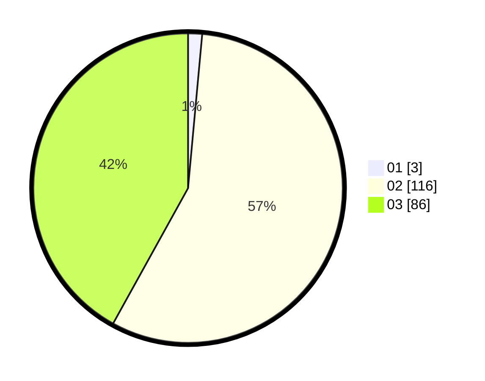

# Hasil

Hasil perolehan suara paslon dapat dilihat pada file paslon-01.txt, paslon-02.txt, dan paslon-03.txt.

Jika tidak ada, artinya data tersebut belum ada pada SIREKAP.

## Perolehan Suara

 * Paslon 01: **3**.
 * Paslon 02: **116**.
 * Paslon 03: **86**.

## Foto C Plano

https://sirekap-obj-formc.kpu.go.id/1cab/pemilu/ppwp/31/73/01/10/06/3173011006220-20240215-023338--38c1ff29-6400-4ae4-822f-bbcb1d21224e.jpg

https://sirekap-obj-formc.kpu.go.id/1cab/pemilu/ppwp/31/73/01/10/06/3173011006220-20240215-014824--9a1ada15-549b-41c6-a16d-a4f28288f3ff.jpg

https://sirekap-obj-formc.kpu.go.id/1cab/pemilu/ppwp/31/73/01/10/06/3173011006220-20240215-015054--49889873-ed0d-4e11-8de3-82f98a432242.jpg

## DATA PEMILIH TETAP

Jumlah pemilih dalam DPT: **283**.
 * L: **136**.
 * P: **147**.

## DATA PENGGUNA HAK PILIH

Jumlah pengguna hak pilih dalam DPT: **185**.
 * L: **88**.
 * P: **97**.

Jumlah pengguna hak pilih dalam DPTb: **17**.
 * L: **13**.
 * P: **4**.

Jumlah pengguna hak pilih dalam DPK: **5**.
 * L: **3**.
 * P: **2**.

Jumlah pengguna hak pilih: **207**.
 * L: **104**.
 * P: **103**.

## JUMLAH SUARA SAH DAN TIDAK SAH

JUMLAH SELURUH SUARA SAH: **205**.

JUMLAH SUARA TIDAK SAH: **3**.

JUMLAH SELURUH SUARA SAH DAN SUARA TIDAK SAH: **208**.
