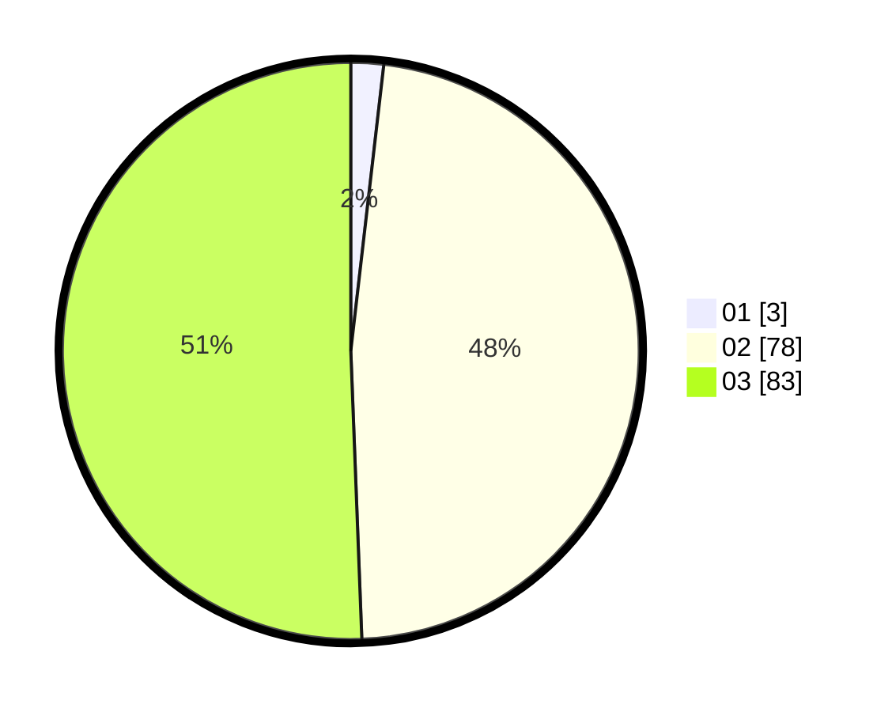

# Hasil

Hasil perolehan suara paslon dapat dilihat pada file paslon-01.txt, paslon-02.txt, dan paslon-03.txt.

Jika tidak ada, artinya data tersebut belum ada pada SIREKAP.

## Perolehan Suara

 * Paslon 01: **3**.
 * Paslon 02: **78**.
 * Paslon 03: **83**.

## Foto C Plano

https://sirekap-obj-formc.kpu.go.id/dafa/pemilu/ppwp/31/73/01/10/06/3173011006221-20240215-004303--516aab77-69c6-469c-adb4-dc4ea9985600.jpg

https://sirekap-obj-formc.kpu.go.id/dafa/pemilu/ppwp/31/73/01/10/06/3173011006221-20240215-004342--7bc68866-334a-434f-9fa7-7373af5077a8.jpg

https://sirekap-obj-formc.kpu.go.id/dafa/pemilu/ppwp/31/73/01/10/06/3173011006221-20240215-004416--99572c34-c8bf-4415-9763-d50b1709b303.jpg
