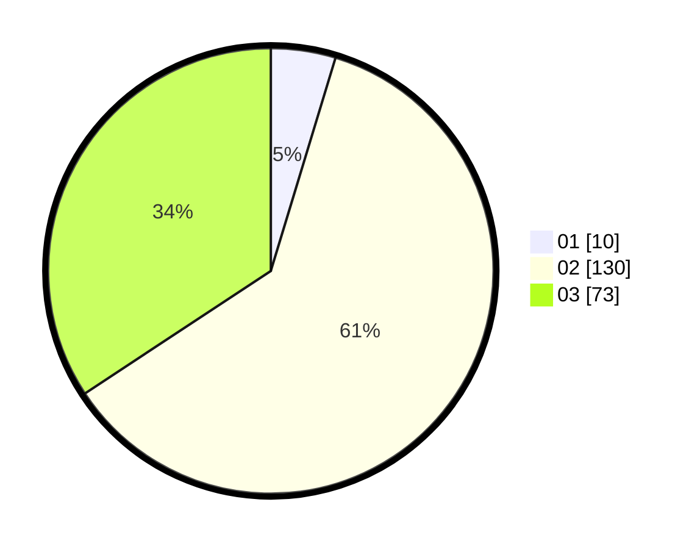

# Hasil

Hasil perolehan suara paslon dapat dilihat pada file paslon-01.txt, paslon-02.txt, dan paslon-03.txt.

Jika tidak ada, artinya data tersebut belum ada pada SIREKAP.

## Perolehan Suara

 * Paslon 01: **10**.
 * Paslon 02: **130**.
 * Paslon 03: **73**.

## Foto C Plano

https://sirekap-obj-formc.kpu.go.id/ea12/pemilu/ppwp/31/73/01/10/06/3173011006224-20240216-140530--d6a33a67-6386-4339-a109-dc5a950b7f67.jpg

https://sirekap-obj-formc.kpu.go.id/ea12/pemilu/ppwp/31/73/01/10/06/3173011006224-20240216-140531--4f2c3a1d-ae3e-4ac6-84df-df2f7492ab9b.jpg

https://sirekap-obj-formc.kpu.go.id/ea12/pemilu/ppwp/31/73/01/10/06/3173011006224-20240216-140531--24e5c90f-7d4a-47e8-a1fb-72195c97d9cb.jpg

## DATA PEMILIH TETAP

Jumlah pemilih dalam DPT: **287**.
 * L: **140**.
 * P: **147**.

## DATA PENGGUNA HAK PILIH

Jumlah pengguna hak pilih dalam DPT: **194**.
 * L: **95**.
 * P: **99**.

Jumlah pengguna hak pilih dalam DPTb: **18**.
 * L: **10**.
 * P: **8**.

Jumlah pengguna hak pilih dalam DPK: **3**.
 * L: **0**.
 * P: **3**.

Jumlah pengguna hak pilih: **215**.
 * L: **105**.
 * P: **110**.

## JUMLAH SUARA SAH DAN TIDAK SAH

JUMLAH SELURUH SUARA SAH: **213**.

JUMLAH SUARA TIDAK SAH: **1**.

JUMLAH SELURUH SUARA SAH DAN SUARA TIDAK SAH: **214**.
