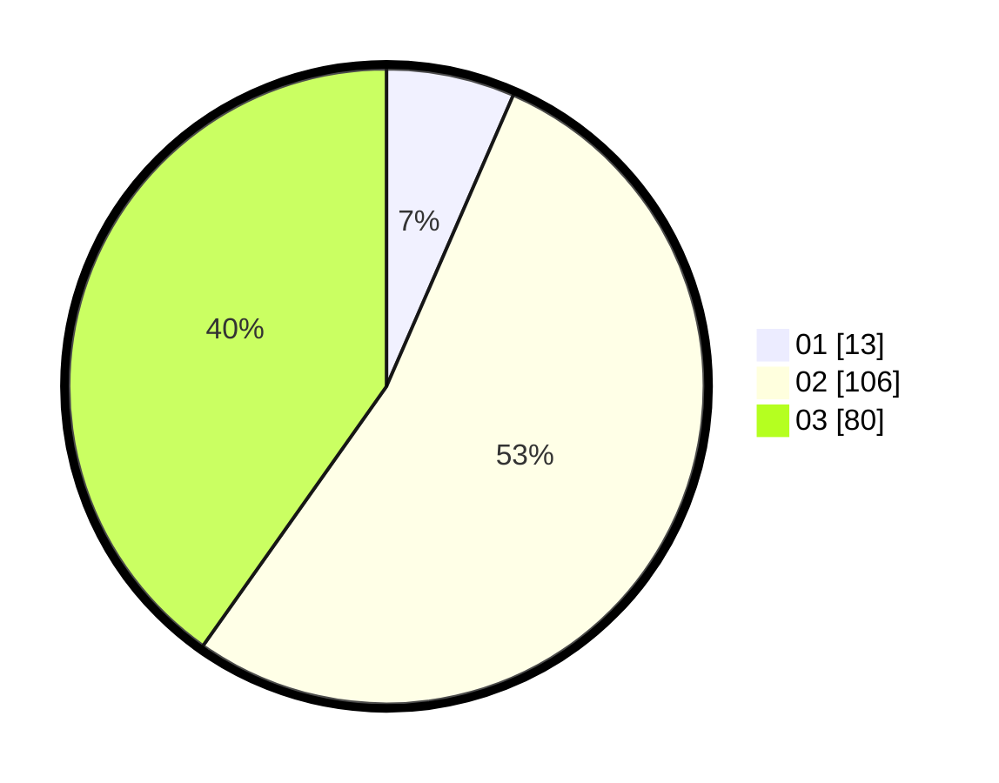

# Hasil

Hasil perolehan suara paslon dapat dilihat pada file paslon-01.txt, paslon-02.txt, dan paslon-03.txt.

Jika tidak ada, artinya data tersebut belum ada pada SIREKAP.

## Perolehan Suara

 * Paslon 01: **13**.
 * Paslon 02: **106**.
 * Paslon 03: **80**.

## Foto C Plano

https://sirekap-obj-formc.kpu.go.id/ee00/pemilu/ppwp/31/73/01/10/06/3173011006227-20240214-222141--2b2b9bc3-e4d5-41ae-900f-c9be53a2e58f.jpg

https://sirekap-obj-formc.kpu.go.id/ee00/pemilu/ppwp/31/73/01/10/06/3173011006227-20240214-222247--19eb510a-7d1d-4f32-9d41-1c15b8bf9afe.jpg
