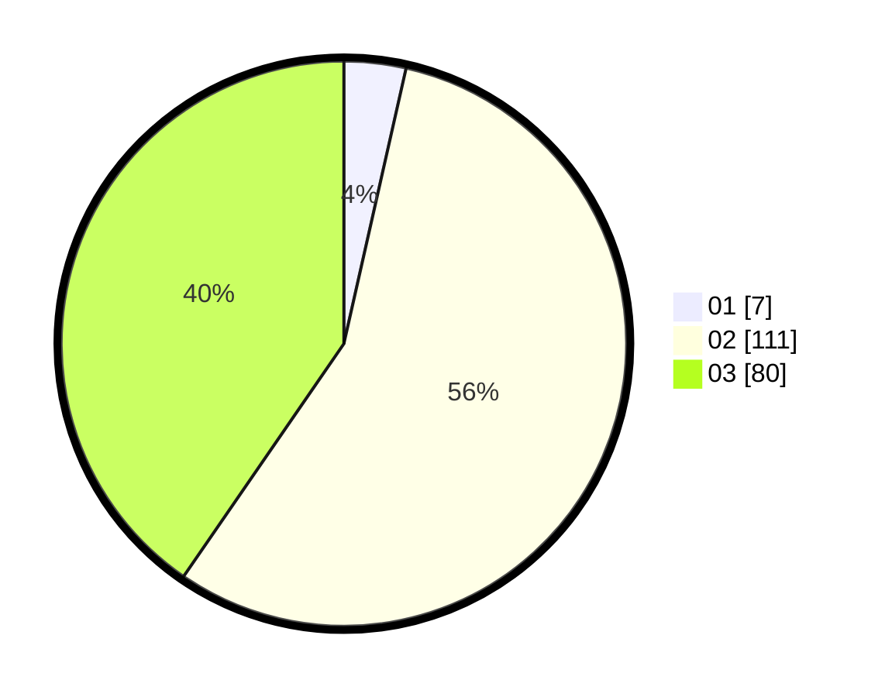

# Hasil

Hasil perolehan suara paslon dapat dilihat pada file paslon-01.txt, paslon-02.txt, dan paslon-03.txt.

Jika tidak ada, artinya data tersebut belum ada pada SIREKAP.

## Perolehan Suara

 * Paslon 01: **7**.
 * Paslon 02: **111**.
 * Paslon 03: **80**.

## Foto C Plano

https://sirekap-obj-formc.kpu.go.id/4257/pemilu/ppwp/31/73/01/10/06/3173011006229-20240214-230159--e15e0b85-5230-4b99-8c49-a35232fbdddd.jpg

https://sirekap-obj-formc.kpu.go.id/4257/pemilu/ppwp/31/73/01/10/06/3173011006229-20240214-230256--77a67105-df29-4f2e-87e8-7c7581eed875.jpg

https://sirekap-obj-formc.kpu.go.id/4257/pemilu/ppwp/31/73/01/10/06/3173011006229-20240214-230345--61803cb9-3ac8-4ad6-9794-c1ad3f173e66.jpg
