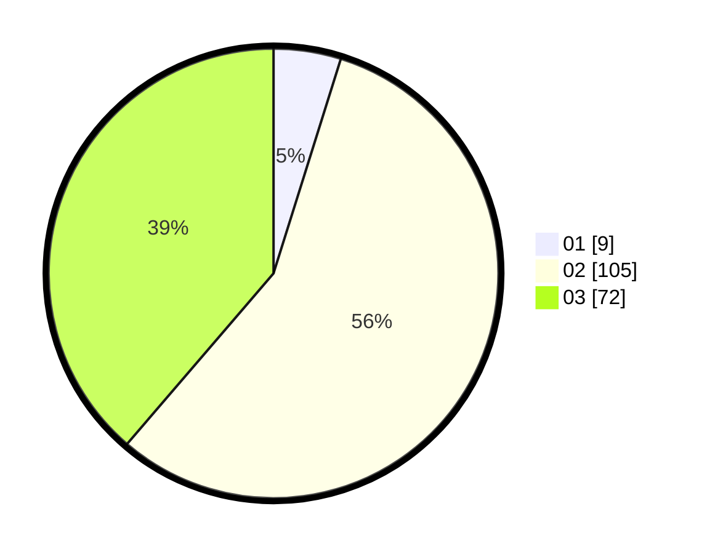

# Hasil

Hasil perolehan suara paslon dapat dilihat pada file paslon-01.txt, paslon-02.txt, dan paslon-03.txt.

Jika tidak ada, artinya data tersebut belum ada pada SIREKAP.

## Perolehan Suara

 * Paslon 01: **9**.
 * Paslon 02: **105**.
 * Paslon 03: **72**.

## Foto C Plano

https://sirekap-obj-formc.kpu.go.id/f74e/pemilu/ppwp/31/73/01/10/06/3173011006230-20240216-023955--f8ce692c-b7c1-4e36-8488-9ffedf6ddd43.jpg

https://sirekap-obj-formc.kpu.go.id/f74e/pemilu/ppwp/31/73/01/10/06/3173011006230-20240216-024010--12b28178-3c79-4362-93ad-6fbb481d9c3f.jpg

https://sirekap-obj-formc.kpu.go.id/f74e/pemilu/ppwp/31/73/01/10/06/3173011006230-20240216-024151--e23b079a-e923-40a3-a71e-d18a53fe7558.jpg

## DATA PEMILIH TETAP

Jumlah pemilih dalam DPT: **287**.
 * L: **136**.
 * P: **151**.

## DATA PENGGUNA HAK PILIH

Jumlah pengguna hak pilih dalam DPT: **164**.
 * L: **74**.
 * P: **90**.

Jumlah pengguna hak pilih dalam DPTb: **16**.
 * L: **5**.
 * P: **11**.

Jumlah pengguna hak pilih dalam DPK: **7**.
 * L: **4**.
 * P: **3**.

Jumlah pengguna hak pilih: **187**.
 * L: **83**.
 * P: **104**.

## JUMLAH SUARA SAH DAN TIDAK SAH

JUMLAH SELURUH SUARA SAH: **186**.

JUMLAH SUARA TIDAK SAH: **1**.

JUMLAH SELURUH SUARA SAH DAN SUARA TIDAK SAH: **187**.
