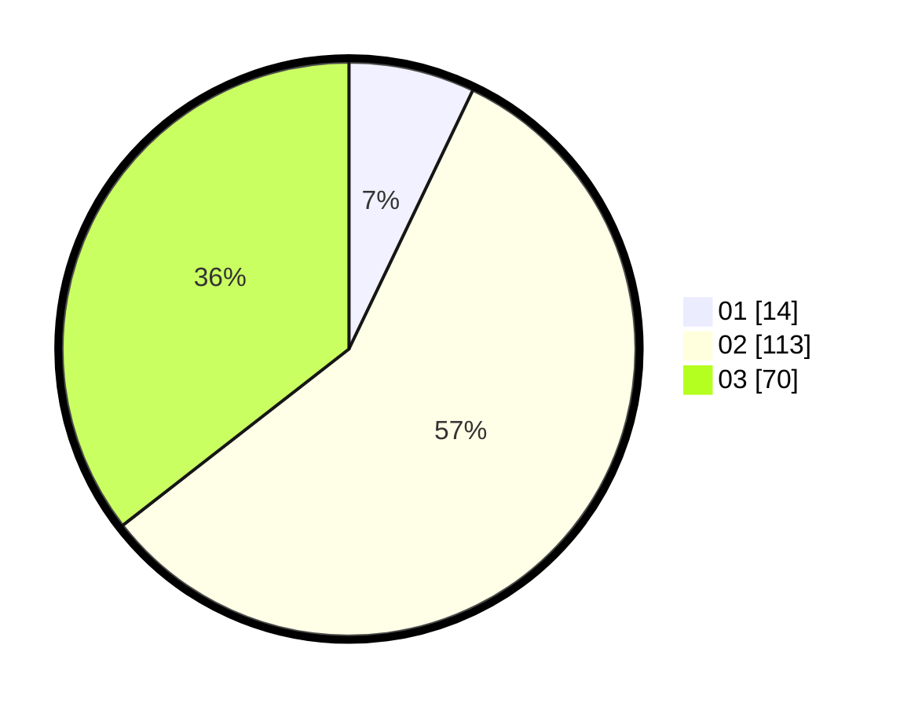

# Hasil

Hasil perolehan suara paslon dapat dilihat pada file paslon-01.txt, paslon-02.txt, dan paslon-03.txt.

Jika tidak ada, artinya data tersebut belum ada pada SIREKAP.

## Perolehan Suara

 * Paslon 01: **14**.
 * Paslon 02: **113**.
 * Paslon 03: **70**.

## Foto C Plano

https://sirekap-obj-formc.kpu.go.id/c756/pemilu/ppwp/31/73/01/10/06/3173011006231-20240216-012337--2ecb0931-d997-4c40-95a8-8e87eb9a1b59.jpg

https://sirekap-obj-formc.kpu.go.id/c756/pemilu/ppwp/31/73/01/10/06/3173011006231-20240216-012355--d6dd3e01-4eb6-4c58-977f-7afca8b1d9dc.jpg

https://sirekap-obj-formc.kpu.go.id/c756/pemilu/ppwp/31/73/01/10/06/3173011006231-20240216-012347--ff79d66e-243c-4f75-bc41-7315b62060d4.jpg

## DATA PEMILIH TETAP

Jumlah pemilih dalam DPT: **197**.
 * L: **90**.
 * P: **107**.

## DATA PENGGUNA HAK PILIH

Jumlah pengguna hak pilih dalam DPT: **173**.
 * L: **77**.
 * P: **96**.

Jumlah pengguna hak pilih dalam DPTb: **14**.
 * L: **9**.
 * P: **5**.

Jumlah pengguna hak pilih dalam DPK: **10**.
 * L: **4**.
 * P: **6**.

Jumlah pengguna hak pilih: **197**.
 * L: **90**.
 * P: **107**.

## JUMLAH SUARA SAH DAN TIDAK SAH

JUMLAH SELURUH SUARA SAH: **197**.

JUMLAH SUARA TIDAK SAH: **0**.

JUMLAH SELURUH SUARA SAH DAN SUARA TIDAK SAH: **197**.
