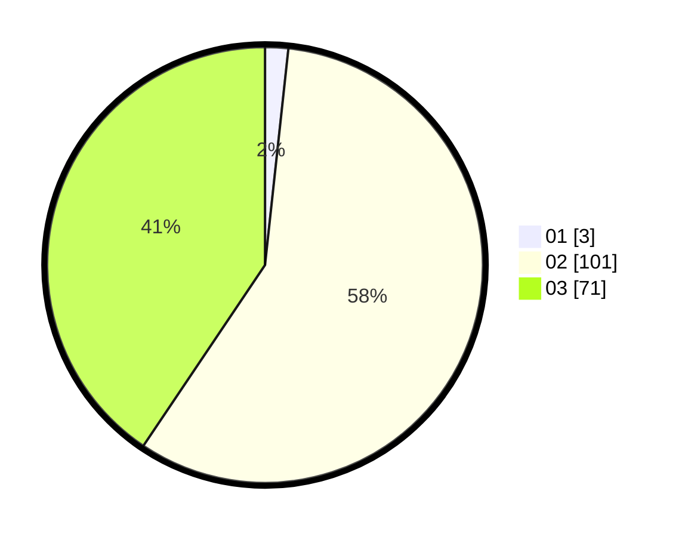

# Hasil

Hasil perolehan suara paslon dapat dilihat pada file paslon-01.txt, paslon-02.txt, dan paslon-03.txt.

Jika tidak ada, artinya data tersebut belum ada pada SIREKAP.

## Perolehan Suara

 * Paslon 01: **3**.
 * Paslon 02: **101**.
 * Paslon 03: **71**.

## Foto C Plano

https://sirekap-obj-formc.kpu.go.id/2479/pemilu/ppwp/31/73/01/10/06/3173011006232-20240214-215327--55d1fbfc-4bde-4cb0-be09-fd2a5baae537.jpg

https://sirekap-obj-formc.kpu.go.id/2479/pemilu/ppwp/31/73/01/10/06/3173011006232-20240214-215515--01c7a786-7ce6-47e9-9d6c-d4c1c4db79e1.jpg

https://sirekap-obj-formc.kpu.go.id/2479/pemilu/ppwp/31/73/01/10/06/3173011006232-20240214-215635--e9a9267d-5968-4bb6-a4c1-bcc5f956e3d8.jpg
