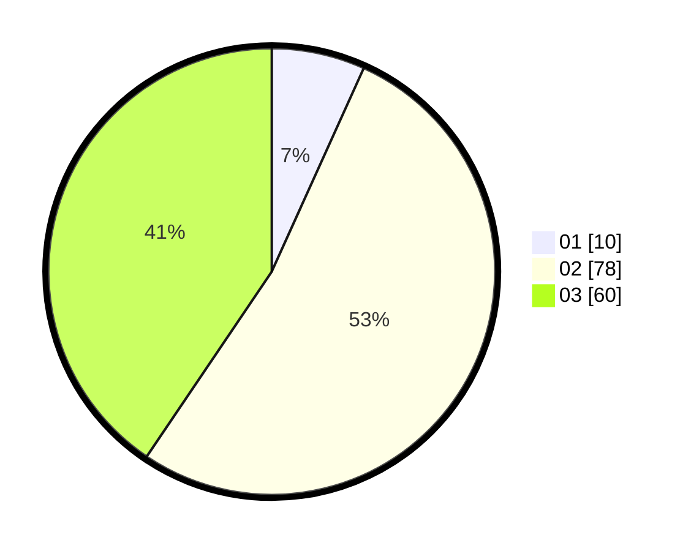

# Hasil

Hasil perolehan suara paslon dapat dilihat pada file paslon-01.txt, paslon-02.txt, dan paslon-03.txt.

Jika tidak ada, artinya data tersebut belum ada pada SIREKAP.

## Perolehan Suara

 * Paslon 01: **10**.
 * Paslon 02: **78**.
 * Paslon 03: **60**.

## Foto C Plano

https://sirekap-obj-formc.kpu.go.id/259e/pemilu/ppwp/31/73/01/10/06/3173011006235-20240215-001347--0649ee9e-76aa-4309-9538-b74d604fbdb3.jpg

https://sirekap-obj-formc.kpu.go.id/259e/pemilu/ppwp/31/73/01/10/06/3173011006235-20240215-225816--7f8272de-f16c-43fc-82f6-4bc0ff6adbd9.jpg

https://sirekap-obj-formc.kpu.go.id/259e/pemilu/ppwp/31/73/01/10/06/3173011006235-20240215-001357--54ca1ace-9e06-4cf8-bc7e-384293187060.jpg
