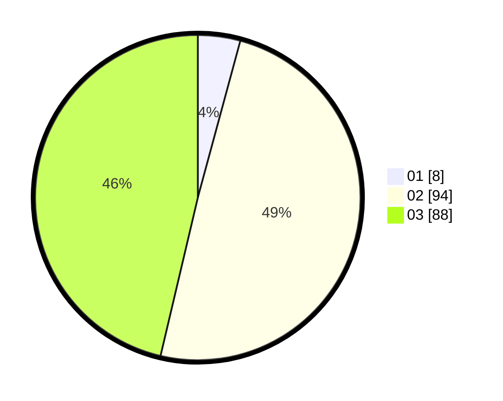

# Hasil

Hasil perolehan suara paslon dapat dilihat pada file paslon-01.txt, paslon-02.txt, dan paslon-03.txt.

Jika tidak ada, artinya data tersebut belum ada pada SIREKAP.

## Perolehan Suara

 * Paslon 01: **8**.
 * Paslon 02: **94**.
 * Paslon 03: **88**.

## Foto C Plano

https://sirekap-obj-formc.kpu.go.id/12ce/pemilu/ppwp/31/73/01/10/06/3173011006239-20240215-210643--5c4aaf4e-e332-45ad-b1f5-9bf125695e10.jpg

https://sirekap-obj-formc.kpu.go.id/12ce/pemilu/ppwp/31/73/01/10/06/3173011006239-20240215-210646--45ee2015-d007-4579-94be-0e8f1f89e97b.jpg

https://sirekap-obj-formc.kpu.go.id/12ce/pemilu/ppwp/31/73/01/10/06/3173011006239-20240215-210644--3cc67d60-aec2-4044-b93e-60356e93d683.jpg

## DATA PEMILIH TETAP

Jumlah pemilih dalam DPT: **274**.
 * L: **127**.
 * P: **147**.

## DATA PENGGUNA HAK PILIH

Jumlah pengguna hak pilih dalam DPT: **189**.
 * L: **88**.
 * P: **101**.

Jumlah pengguna hak pilih dalam DPTb: **2**.
 * L: **0**.
 * P: **2**.

Jumlah pengguna hak pilih dalam DPK: **0**.
 * L: **0**.
 * P: **0**.

Jumlah pengguna hak pilih: **191**.
 * L: **88**.
 * P: **103**.

## JUMLAH SUARA SAH DAN TIDAK SAH

JUMLAH SELURUH SUARA SAH: **190**.

JUMLAH SUARA TIDAK SAH: **1**.

JUMLAH SELURUH SUARA SAH DAN SUARA TIDAK SAH: **191**.
