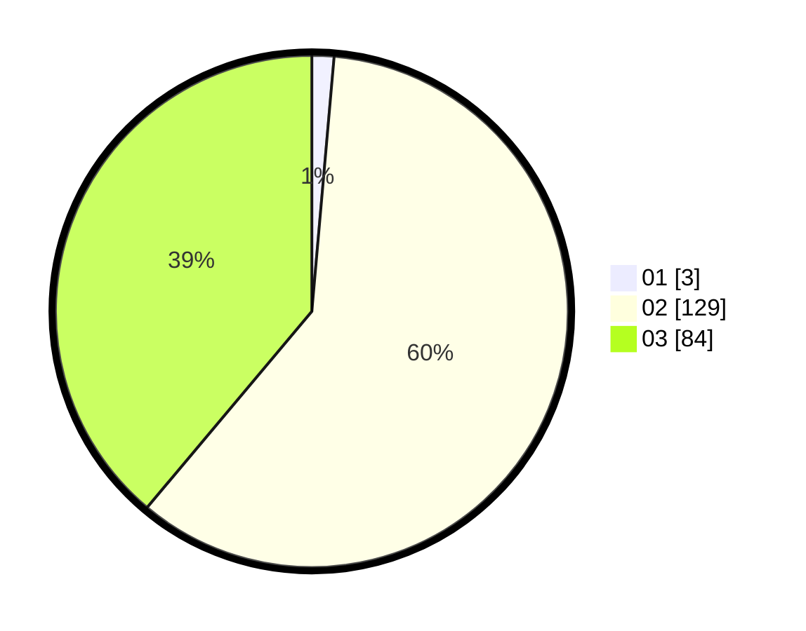

# Hasil

Hasil perolehan suara paslon dapat dilihat pada file paslon-01.txt, paslon-02.txt, dan paslon-03.txt.

Jika tidak ada, artinya data tersebut belum ada pada SIREKAP.

## Perolehan Suara

 * Paslon 01: **3**.
 * Paslon 02: **129**.
 * Paslon 03: **84**.

## Foto C Plano

https://sirekap-obj-formc.kpu.go.id/2cb5/pemilu/ppwp/31/73/01/10/06/3173011006240-20240214-231243--25114dc9-0b04-4f91-92f7-40e7f5ffbb50.jpg

https://sirekap-obj-formc.kpu.go.id/2cb5/pemilu/ppwp/31/73/01/10/06/3173011006240-20240214-211344--d2fea74b-2aee-4d0b-b8db-c46a421c9b44.jpg

https://sirekap-obj-formc.kpu.go.id/2cb5/pemilu/ppwp/31/73/01/10/06/3173011006240-20240214-213541--b2c9c030-367d-48dd-980e-ab532056dee3.jpg
