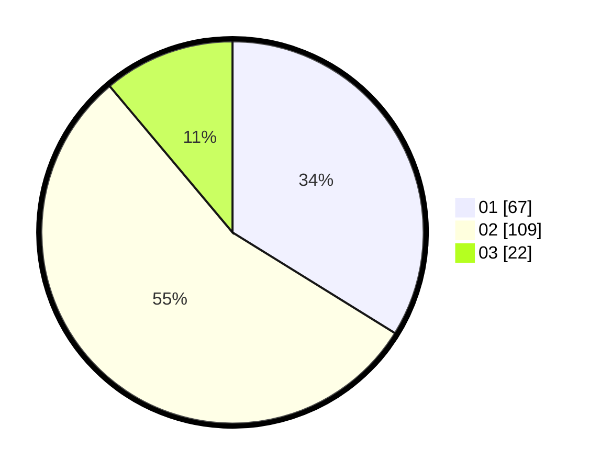

# Hasil

Hasil perolehan suara paslon dapat dilihat pada file paslon-01.txt, paslon-02.txt, dan paslon-03.txt.

Jika tidak ada, artinya data tersebut belum ada pada SIREKAP.

## Perolehan Suara

 * Paslon 01: **67**.
 * Paslon 02: **109**.
 * Paslon 03: **22**.

## Foto C Plano

https://sirekap-obj-formc.kpu.go.id/a604/pemilu/ppwp/31/73/01/10/06/3173011006244-20240215-212352--2690877d-ef0d-4bf9-af71-9bc9a5147477.jpg

https://sirekap-obj-formc.kpu.go.id/a604/pemilu/ppwp/31/73/01/10/06/3173011006244-20240215-212354--645ed8b8-3b2e-47b7-9ed2-07f39ccffdb9.jpg

https://sirekap-obj-formc.kpu.go.id/a604/pemilu/ppwp/31/73/01/10/06/3173011006244-20240215-212353--3e392ffb-8bac-4178-93a3-a2b977e29474.jpg

## DATA PEMILIH TETAP

Jumlah pemilih dalam DPT: **199**.
 * L: **92**.
 * P: **107**.

## DATA PENGGUNA HAK PILIH

Jumlah pengguna hak pilih dalam DPT: **199**.
 * L: **92**.
 * P: **107**.

Jumlah pengguna hak pilih dalam DPTb: **0**.
 * L: **0**.
 * P: **0**.

Jumlah pengguna hak pilih dalam DPK: **1**.
 * L: **1**.
 * P: **0**.

Jumlah pengguna hak pilih: **200**.
 * L: **93**.
 * P: **107**.

## JUMLAH SUARA SAH DAN TIDAK SAH

JUMLAH SELURUH SUARA SAH: **198**.

JUMLAH SUARA TIDAK SAH: **2**.

JUMLAH SELURUH SUARA SAH DAN SUARA TIDAK SAH: **200**.
