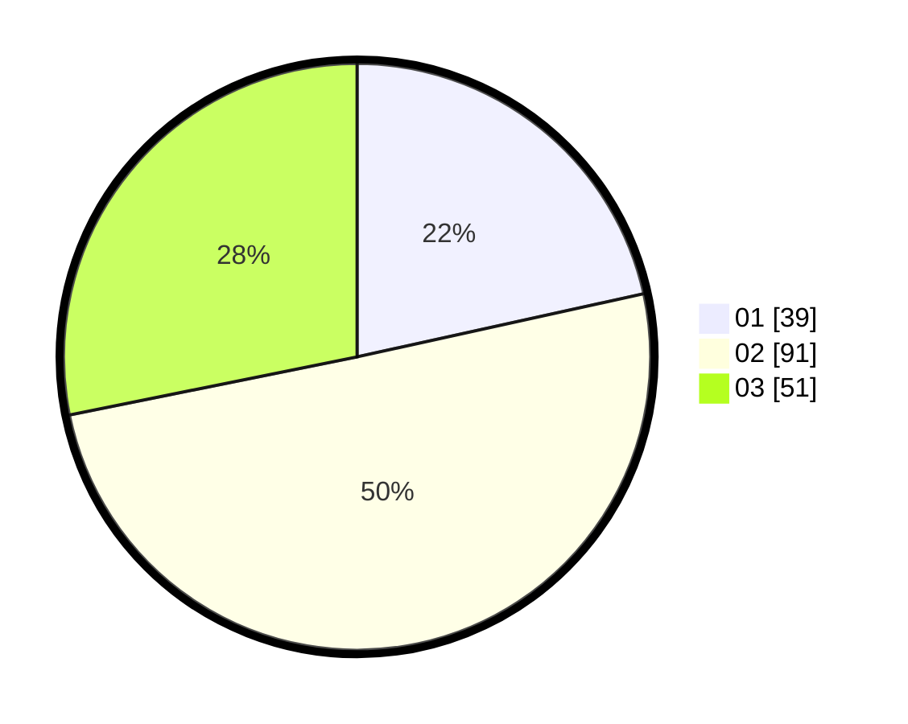

# Hasil

Hasil perolehan suara paslon dapat dilihat pada file paslon-01.txt, paslon-02.txt, dan paslon-03.txt.

Jika tidak ada, artinya data tersebut belum ada pada SIREKAP.

## Perolehan Suara

 * Paslon 01: **39**.
 * Paslon 02: **91**.
 * Paslon 03: **51**.

## Foto C Plano

https://sirekap-obj-formc.kpu.go.id/bf1d/pemilu/ppwp/31/73/01/10/06/3173011006248-20240216-023444--44397068-b1d6-4130-9e9d-a11a755a9e0a.jpg

https://sirekap-obj-formc.kpu.go.id/bf1d/pemilu/ppwp/31/73/01/10/06/3173011006248-20240216-023450--75ede4df-4c50-46fb-9068-1d14d0c31e05.jpg

https://sirekap-obj-formc.kpu.go.id/bf1d/pemilu/ppwp/31/73/01/10/06/3173011006248-20240216-023447--33f406e4-7bf8-484c-8db0-fff9a07c7bcb.jpg

## DATA PEMILIH TETAP

Jumlah pemilih dalam DPT: **238**.
 * L: **111**.
 * P: **127**.

## DATA PENGGUNA HAK PILIH

Jumlah pengguna hak pilih dalam DPT: **173**.
 * L: **76**.
 * P: **97**.

Jumlah pengguna hak pilih dalam DPTb: **9**.
 * L: **3**.
 * P: **6**.

Jumlah pengguna hak pilih dalam DPK: **0**.
 * L: **0**.
 * P: **0**.

Jumlah pengguna hak pilih: **182**.
 * L: **79**.
 * P: **103**.

## JUMLAH SUARA SAH DAN TIDAK SAH

JUMLAH SELURUH SUARA SAH: **181**.

JUMLAH SUARA TIDAK SAH: **1**.

JUMLAH SELURUH SUARA SAH DAN SUARA TIDAK SAH: **182**.
