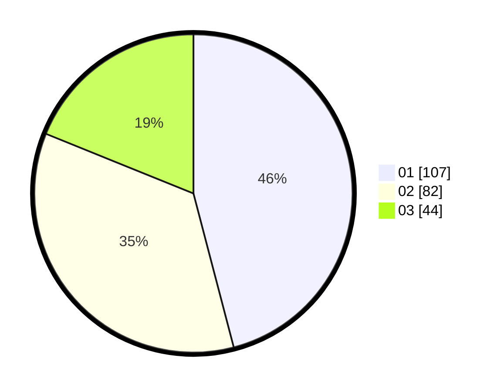

# Hasil

Hasil perolehan suara paslon dapat dilihat pada file paslon-01.txt, paslon-02.txt, dan paslon-03.txt.

Jika tidak ada, artinya data tersebut belum ada pada SIREKAP.

## Perolehan Suara

 * Paslon 01: **107**.
 * Paslon 02: **82**.
 * Paslon 03: **44**.

## Foto C Plano

https://sirekap-obj-formc.kpu.go.id/e720/pemilu/ppwp/31/73/01/10/06/3173011006251-20240215-022810--8a9ae318-0f76-499c-9e29-9bfaab5f7abb.jpg

https://sirekap-obj-formc.kpu.go.id/e720/pemilu/ppwp/31/73/01/10/06/3173011006251-20240215-024624--f43f77c6-1872-4d7b-9598-6cb4c1e94d6d.jpg

https://sirekap-obj-formc.kpu.go.id/e720/pemilu/ppwp/31/73/01/10/06/3173011006251-20240215-025002--2f719995-6ebf-4b78-be7e-b889e3b35026.jpg
