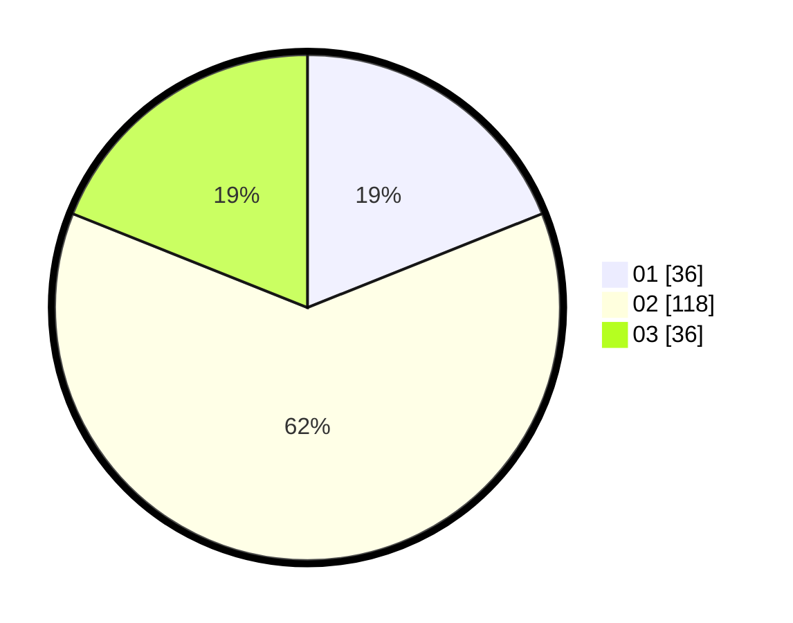

# Hasil

Hasil perolehan suara paslon dapat dilihat pada file paslon-01.txt, paslon-02.txt, dan paslon-03.txt.

Jika tidak ada, artinya data tersebut belum ada pada SIREKAP.

## Perolehan Suara

 * Paslon 01: **36**.
 * Paslon 02: **118**.
 * Paslon 03: **36**.

## Foto C Plano

https://sirekap-obj-formc.kpu.go.id/3760/pemilu/ppwp/31/73/01/10/06/3173011006255-20240215-221703--7cbc71e3-8884-46dd-aa75-f9cdcdc5bf38.jpg

https://sirekap-obj-formc.kpu.go.id/3760/pemilu/ppwp/31/73/01/10/06/3173011006255-20240215-221705--efdfd7eb-815e-44c5-a767-03dabdf17a74.jpg

https://sirekap-obj-formc.kpu.go.id/3760/pemilu/ppwp/31/73/01/10/06/3173011006255-20240215-221704--cb5aadac-bb83-4f71-8002-ad84519db291.jpg

## DATA PEMILIH TETAP

Jumlah pemilih dalam DPT: **264**.
 * L: **136**.
 * P: **128**.

## DATA PENGGUNA HAK PILIH

Jumlah pengguna hak pilih dalam DPT: **192**.
 * L: **94**.
 * P: **98**.

Jumlah pengguna hak pilih dalam DPTb: **4**.
 * L: **2**.
 * P: **2**.

Jumlah pengguna hak pilih dalam DPK: **2**.
 * L: **1**.
 * P: **1**.

Jumlah pengguna hak pilih: **198**.
 * L: **97**.
 * P: **101**.

## JUMLAH SUARA SAH DAN TIDAK SAH

JUMLAH SELURUH SUARA SAH: **190**.

JUMLAH SUARA TIDAK SAH: **8**.

JUMLAH SELURUH SUARA SAH DAN SUARA TIDAK SAH: **198**.
