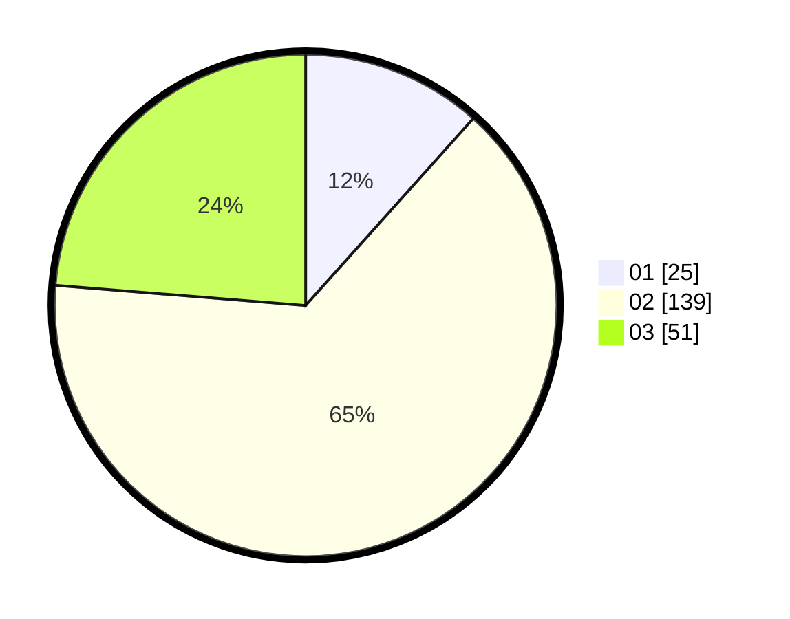

# Hasil

Hasil perolehan suara paslon dapat dilihat pada file paslon-01.txt, paslon-02.txt, dan paslon-03.txt.

Jika tidak ada, artinya data tersebut belum ada pada SIREKAP.

## Perolehan Suara

 * Paslon 01: **25**.
 * Paslon 02: **139**.
 * Paslon 03: **51**.

## Foto C Plano

https://sirekap-obj-formc.kpu.go.id/fe41/pemilu/ppwp/31/73/01/10/06/3173011006258-20240215-210743--ddbdf936-615c-49ca-b625-1aa827ba4b64.jpg

https://sirekap-obj-formc.kpu.go.id/fe41/pemilu/ppwp/31/73/01/10/06/3173011006258-20240215-210746--6fd1550f-d73b-49fe-81a2-22a351387a8b.jpg

https://sirekap-obj-formc.kpu.go.id/fe41/pemilu/ppwp/31/73/01/10/06/3173011006258-20240215-210745--3f9bb947-eab8-443d-91b8-e00439c91296.jpg

## DATA PEMILIH TETAP

Jumlah pemilih dalam DPT: **284**.
 * L: **150**.
 * P: **134**.

## DATA PENGGUNA HAK PILIH

Jumlah pengguna hak pilih dalam DPT: **212**.
 * L: **107**.
 * P: **105**.

Jumlah pengguna hak pilih dalam DPTb: **3**.
 * L: **1**.
 * P: **2**.

Jumlah pengguna hak pilih dalam DPK: **4**.
 * L: **2**.
 * P: **2**.

Jumlah pengguna hak pilih: **219**.
 * L: **110**.
 * P: **109**.

## JUMLAH SUARA SAH DAN TIDAK SAH

JUMLAH SELURUH SUARA SAH: **215**.

JUMLAH SUARA TIDAK SAH: **4**.

JUMLAH SELURUH SUARA SAH DAN SUARA TIDAK SAH: **219**.
