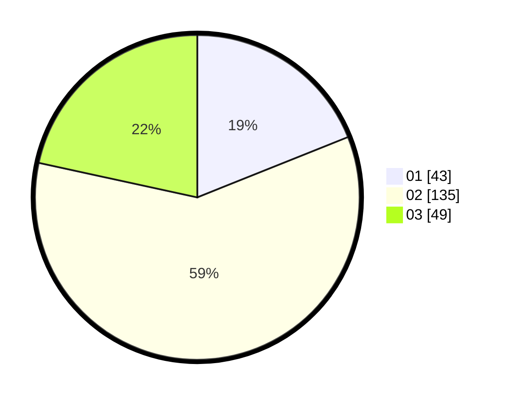

# Hasil

Hasil perolehan suara paslon dapat dilihat pada file paslon-01.txt, paslon-02.txt, dan paslon-03.txt.

Jika tidak ada, artinya data tersebut belum ada pada SIREKAP.

## Perolehan Suara

 * Paslon 01: **43**.
 * Paslon 02: **135**.
 * Paslon 03: **49**.

## Foto C Plano

https://sirekap-obj-formc.kpu.go.id/c8b7/pemilu/ppwp/31/73/01/10/06/3173011006268-20240215-013435--241aa53b-7f99-4caa-ae23-62ec74ff3099.jpg

https://sirekap-obj-formc.kpu.go.id/c8b7/pemilu/ppwp/31/73/01/10/06/3173011006268-20240215-013457--dc908f47-c01d-4dfc-8723-0c714d4e080f.jpg

https://sirekap-obj-formc.kpu.go.id/c8b7/pemilu/ppwp/31/73/01/10/06/3173011006268-20240215-013446--1d8436cf-a45a-46e7-86a5-4abd23142a4c.jpg

## DATA PEMILIH TETAP

Jumlah pemilih dalam DPT: **282**.
 * L: **139**.
 * P: **143**.

## DATA PENGGUNA HAK PILIH

Jumlah pengguna hak pilih dalam DPT: **223**.
 * L: **110**.
 * P: **113**.

Jumlah pengguna hak pilih dalam DPTb: **5**.
 * L: **2**.
 * P: **3**.

Jumlah pengguna hak pilih dalam DPK: **2**.
 * L: **1**.
 * P: **1**.

Jumlah pengguna hak pilih: **230**.
 * L: **113**.
 * P: **117**.

## JUMLAH SUARA SAH DAN TIDAK SAH

JUMLAH SELURUH SUARA SAH: **227**.

JUMLAH SUARA TIDAK SAH: **3**.

JUMLAH SELURUH SUARA SAH DAN SUARA TIDAK SAH: **230**.
