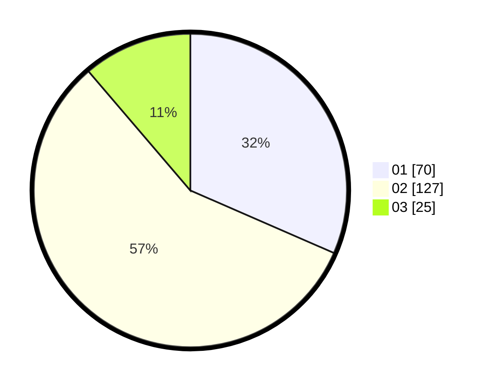

# Hasil

Hasil perolehan suara paslon dapat dilihat pada file paslon-01.txt, paslon-02.txt, dan paslon-03.txt.

Jika tidak ada, artinya data tersebut belum ada pada SIREKAP.

## Perolehan Suara

 * Paslon 01: **70**.
 * Paslon 02: **127**.
 * Paslon 03: **25**.

## Foto C Plano

https://sirekap-obj-formc.kpu.go.id/e939/pemilu/ppwp/31/73/01/10/06/3173011006270-20240216-082924--17b3895b-6507-4e71-b589-b1d4ef6e21ff.jpg

https://sirekap-obj-formc.kpu.go.id/e939/pemilu/ppwp/31/73/01/10/06/3173011006270-20240216-082926--cdd27828-6bb6-4d33-987a-b3229bde282b.jpg

https://sirekap-obj-formc.kpu.go.id/e939/pemilu/ppwp/31/73/01/10/06/3173011006270-20240216-082925--46ffe43e-b03c-4205-9507-64ea688f736e.jpg

## DATA PEMILIH TETAP

Jumlah pemilih dalam DPT: **278**.
 * L: **131**.
 * P: **147**.

## DATA PENGGUNA HAK PILIH

Jumlah pengguna hak pilih dalam DPT: **219**.
 * L: **105**.
 * P: **114**.

Jumlah pengguna hak pilih dalam DPTb: **2**.
 * L: **0**.
 * P: **2**.

Jumlah pengguna hak pilih dalam DPK: **2**.
 * L: **1**.
 * P: **1**.

Jumlah pengguna hak pilih: **223**.
 * L: **106**.
 * P: **117**.

## JUMLAH SUARA SAH DAN TIDAK SAH

JUMLAH SELURUH SUARA SAH: **222**.

JUMLAH SUARA TIDAK SAH: **1**.

JUMLAH SELURUH SUARA SAH DAN SUARA TIDAK SAH: **223**.
