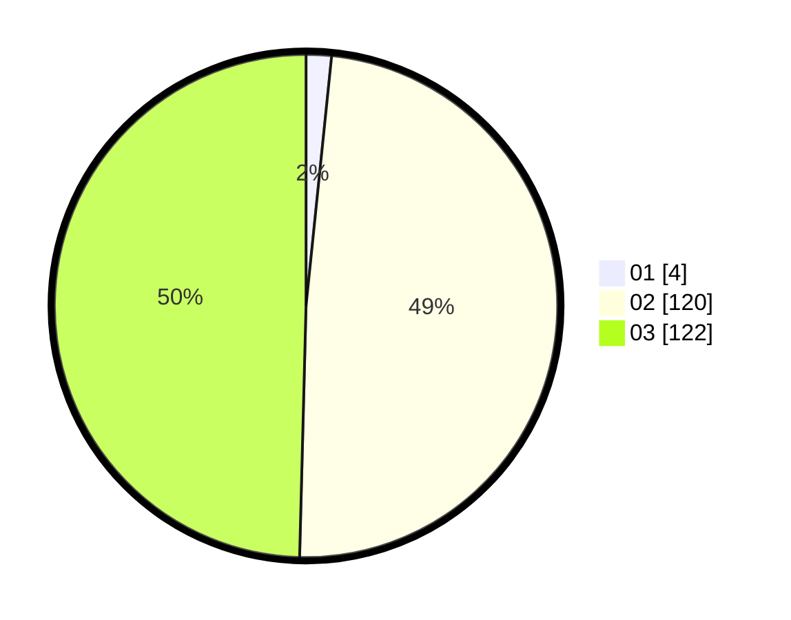

# Hasil

Hasil perolehan suara paslon dapat dilihat pada file paslon-01.txt, paslon-02.txt, dan paslon-03.txt.

Jika tidak ada, artinya data tersebut belum ada pada SIREKAP.

## Perolehan Suara

 * Paslon 01: **4**.
 * Paslon 02: **120**.
 * Paslon 03: **122**.

## Foto C Plano

https://sirekap-obj-formc.kpu.go.id/12a9/pemilu/ppwp/31/73/01/10/06/3173011006275-20240214-203902--689d1a17-6f4d-48da-8b27-3c519f71aeb7.jpg

https://sirekap-obj-formc.kpu.go.id/12a9/pemilu/ppwp/31/73/01/10/06/3173011006275-20240214-202744--c032d7e1-ee62-443c-8417-d67313093891.jpg

https://sirekap-obj-formc.kpu.go.id/12a9/pemilu/ppwp/31/73/01/10/06/3173011006275-20240214-202838--6ca9607e-402f-4807-9303-688b9206fbe2.jpg

## DATA PEMILIH TETAP

Jumlah pemilih dalam DPT: **288**.
 * L: **135**.
 * P: **153**.

## DATA PENGGUNA HAK PILIH

Jumlah pengguna hak pilih dalam DPT: **225**.
 * L: **106**.
 * P: **119**.

Jumlah pengguna hak pilih dalam DPTb: **19**.
 * L: **8**.
 * P: **11**.

Jumlah pengguna hak pilih dalam DPK: **3**.
 * L: **1**.
 * P: **2**.

Jumlah pengguna hak pilih: **247**.
 * L: **115**.
 * P: **132**.

## JUMLAH SUARA SAH DAN TIDAK SAH

JUMLAH SELURUH SUARA SAH: **246**.

JUMLAH SUARA TIDAK SAH: **1**.

JUMLAH SELURUH SUARA SAH DAN SUARA TIDAK SAH: **247**.
