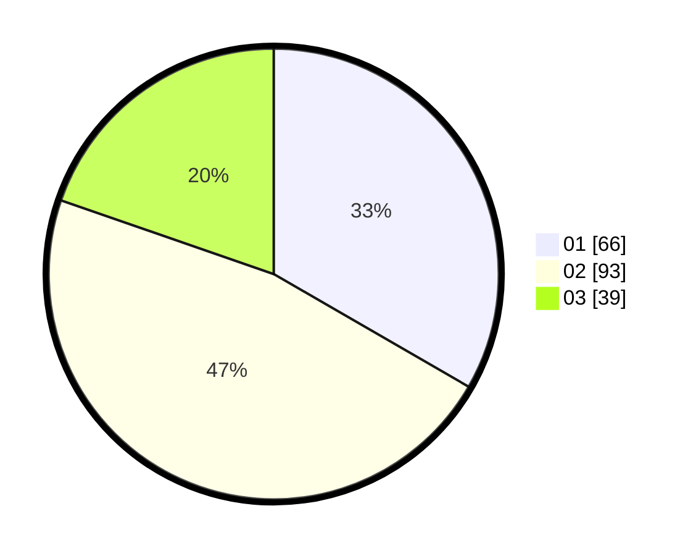

# Hasil

Hasil perolehan suara paslon dapat dilihat pada file paslon-01.txt, paslon-02.txt, dan paslon-03.txt.

Jika tidak ada, artinya data tersebut belum ada pada SIREKAP.

## Perolehan Suara

 * Paslon 01: **66**.
 * Paslon 02: **93**.
 * Paslon 03: **39**.

## Foto C Plano

https://sirekap-obj-formc.kpu.go.id/21d4/pemilu/ppwp/31/73/02/10/01/3173021001002-20240215-012746--7f83e608-30be-49d2-9d79-e34d41ce3332.jpg

https://sirekap-obj-formc.kpu.go.id/21d4/pemilu/ppwp/31/73/02/10/01/3173021001002-20240215-011418--02b2b6a1-6d0e-4e7b-b522-38c0ca9178aa.jpg

https://sirekap-obj-formc.kpu.go.id/21d4/pemilu/ppwp/31/73/02/10/01/3173021001002-20240215-012946--c099314c-7d3b-4c90-8530-f034c8a173da.jpg
