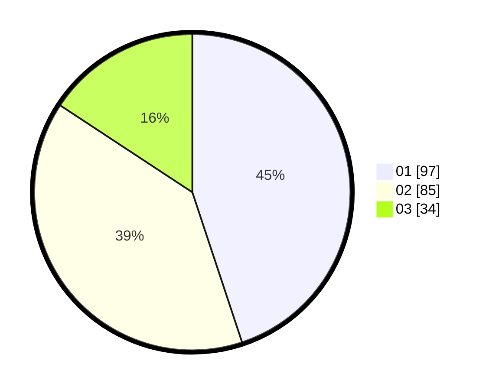

# Hasil

Hasil perolehan suara paslon dapat dilihat pada file paslon-01.txt, paslon-02.txt, dan paslon-03.txt.

Jika tidak ada, artinya data tersebut belum ada pada SIREKAP.

## Perolehan Suara

 * Paslon 01: **97**.
 * Paslon 02: **85**.
 * Paslon 03: **34**.

## Foto C Plano

https://sirekap-obj-formc.kpu.go.id/80fe/pemilu/ppwp/31/73/02/10/01/3173021001004-20240214-211816--f428603d-2d89-43a9-bb40-8c788a75181d.jpg

https://sirekap-obj-formc.kpu.go.id/80fe/pemilu/ppwp/31/73/02/10/01/3173021001004-20240214-200755--3826408a-927d-46fc-868e-4aa01c5d71dd.jpg

https://sirekap-obj-formc.kpu.go.id/80fe/pemilu/ppwp/31/73/02/10/01/3173021001004-20240214-230043--17d264e4-edfe-4c1e-bf02-f7896bff249c.jpg

## DATA PEMILIH TETAP

Jumlah pemilih dalam DPT: **258**.
 * L: **127**.
 * P: **131**.

## DATA PENGGUNA HAK PILIH

Jumlah pengguna hak pilih dalam DPT: **193**.
 * L: **84**.
 * P: **109**.

Jumlah pengguna hak pilih dalam DPTb: **23**.
 * L: **8**.
 * P: **15**.

Jumlah pengguna hak pilih dalam DPK: **2**.
 * L: **0**.
 * P: **2**.

Jumlah pengguna hak pilih: **218**.
 * L: **92**.
 * P: **126**.

## JUMLAH SUARA SAH DAN TIDAK SAH

JUMLAH SELURUH SUARA SAH: **216**.

JUMLAH SUARA TIDAK SAH: **2**.

JUMLAH SELURUH SUARA SAH DAN SUARA TIDAK SAH: **218**.
