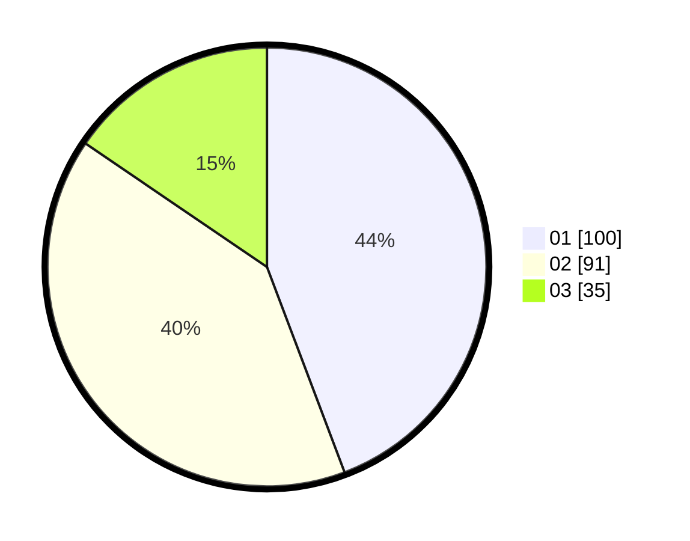

# Hasil

Hasil perolehan suara paslon dapat dilihat pada file paslon-01.txt, paslon-02.txt, dan paslon-03.txt.

Jika tidak ada, artinya data tersebut belum ada pada SIREKAP.

## Perolehan Suara

 * Paslon 01: **100**.
 * Paslon 02: **91**.
 * Paslon 03: **35**.

## Foto C Plano

https://sirekap-obj-formc.kpu.go.id/2400/pemilu/ppwp/31/73/02/10/01/3173021001007-20240214-222425--a0fb7d5e-2938-4a07-9e99-0dae93f535c1.jpg

https://sirekap-obj-formc.kpu.go.id/2400/pemilu/ppwp/31/73/02/10/01/3173021001007-20240214-222624--acd488e5-34a7-4bb2-8ec5-a97a52232e9a.jpg

https://sirekap-obj-formc.kpu.go.id/2400/pemilu/ppwp/31/73/02/10/01/3173021001007-20240214-222739--cc66a385-71ce-4d3d-bb6e-2a5f05151098.jpg

## DATA PEMILIH TETAP

Jumlah pemilih dalam DPT: **256**.
 * L: **137**.
 * P: **119**.

## DATA PENGGUNA HAK PILIH

Jumlah pengguna hak pilih dalam DPT: **203**.
 * L: **105**.
 * P: **98**.

Jumlah pengguna hak pilih dalam DPTb: **22**.
 * L: **12**.
 * P: **10**.

Jumlah pengguna hak pilih dalam DPK: **2**.
 * L: **1**.
 * P: **1**.

Jumlah pengguna hak pilih: **227**.
 * L: **118**.
 * P: **109**.

## JUMLAH SUARA SAH DAN TIDAK SAH

JUMLAH SELURUH SUARA SAH: **226**.

JUMLAH SUARA TIDAK SAH: **1**.

JUMLAH SELURUH SUARA SAH DAN SUARA TIDAK SAH: **227**.
