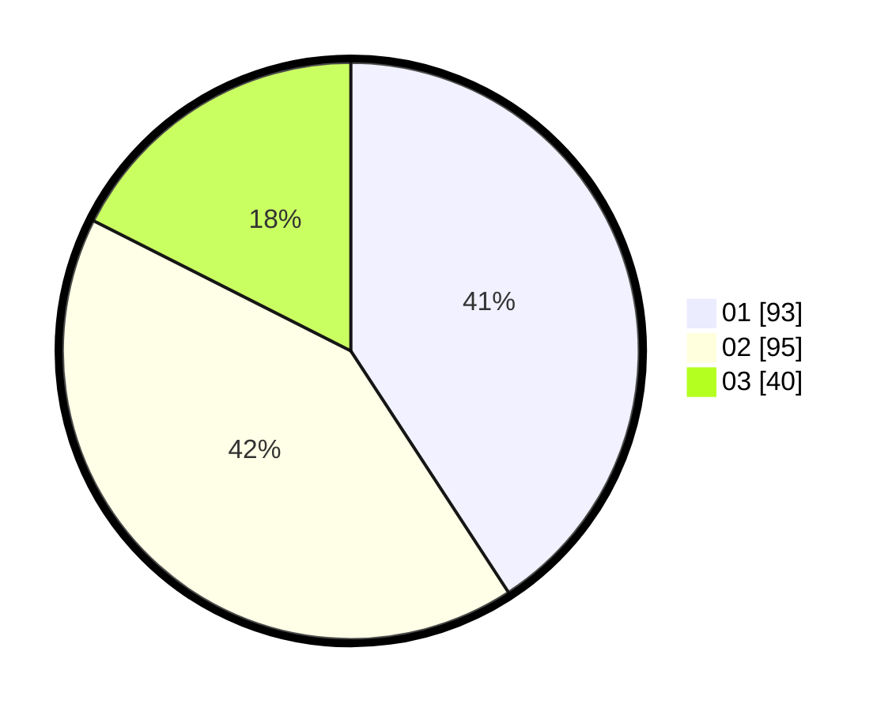

# Hasil

Hasil perolehan suara paslon dapat dilihat pada file paslon-01.txt, paslon-02.txt, dan paslon-03.txt.

Jika tidak ada, artinya data tersebut belum ada pada SIREKAP.

## Perolehan Suara

 * Paslon 01: **93**.
 * Paslon 02: **95**.
 * Paslon 03: **40**.

## Foto C Plano

https://sirekap-obj-formc.kpu.go.id/12ae/pemilu/ppwp/31/73/02/10/01/3173021001009-20240217-171342--19d25d50-c68b-4a8e-984c-8f558b413b80.jpg

https://sirekap-obj-formc.kpu.go.id/12ae/pemilu/ppwp/31/73/02/10/01/3173021001009-20240217-171157--ae0530e7-a785-4eb9-9b55-871f46710aef.jpg

https://sirekap-obj-formc.kpu.go.id/12ae/pemilu/ppwp/31/73/02/10/01/3173021001009-20240217-171223--e901d0b5-920c-4ddd-9eee-e91899174986.jpg

## DATA PEMILIH TETAP

Jumlah pemilih dalam DPT: **255**.
 * L: **125**.
 * P: **130**.

## DATA PENGGUNA HAK PILIH

Jumlah pengguna hak pilih dalam DPT: **211**.
 * L: **101**.
 * P: **110**.

Jumlah pengguna hak pilih dalam DPTb: **14**.
 * L: **4**.
 * P: **10**.

Jumlah pengguna hak pilih dalam DPK: **4**.
 * L: **2**.
 * P: **2**.

Jumlah pengguna hak pilih: **229**.
 * L: **107**.
 * P: **122**.

## JUMLAH SUARA SAH DAN TIDAK SAH

JUMLAH SELURUH SUARA SAH: **228**.

JUMLAH SUARA TIDAK SAH: **1**.

JUMLAH SELURUH SUARA SAH DAN SUARA TIDAK SAH: **229**.
