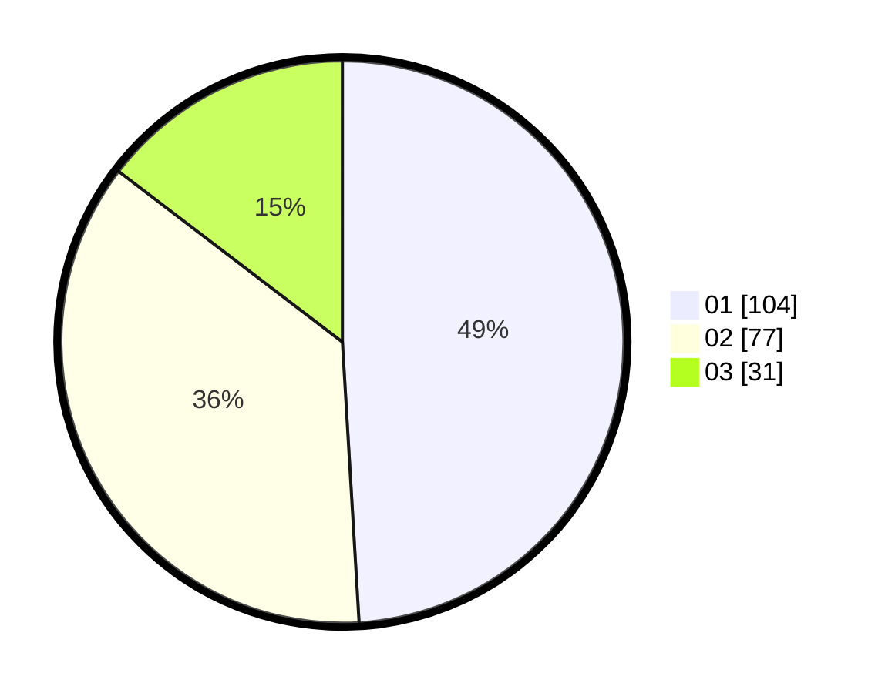

# Hasil

Hasil perolehan suara paslon dapat dilihat pada file paslon-01.txt, paslon-02.txt, dan paslon-03.txt.

Jika tidak ada, artinya data tersebut belum ada pada SIREKAP.

## Perolehan Suara

 * Paslon 01: **104**.
 * Paslon 02: **77**.
 * Paslon 03: **31**.

## Foto C Plano

https://sirekap-obj-formc.kpu.go.id/3651/pemilu/ppwp/31/73/02/10/01/3173021001010-20240214-155219--f8b558c3-ef1f-4c88-a105-99cc826b024c.jpg

https://sirekap-obj-formc.kpu.go.id/3651/pemilu/ppwp/31/73/02/10/01/3173021001010-20240214-155303--91455ebd-061a-42af-b9f8-149ad8a0913b.jpg
