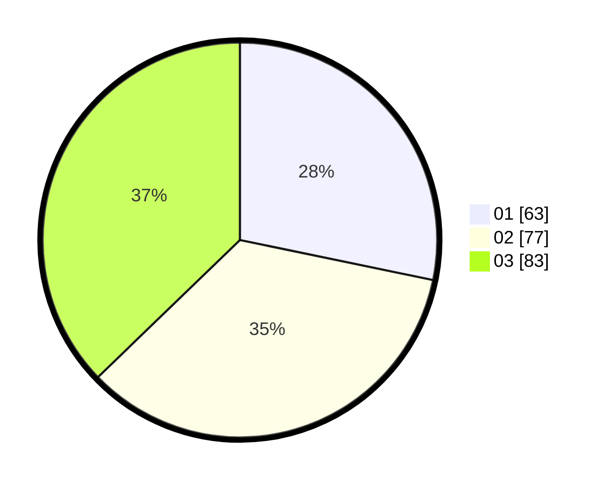

# Hasil

Hasil perolehan suara paslon dapat dilihat pada file paslon-01.txt, paslon-02.txt, dan paslon-03.txt.

Jika tidak ada, artinya data tersebut belum ada pada SIREKAP.

## Perolehan Suara

 * Paslon 01: **63**.
 * Paslon 02: **77**.
 * Paslon 03: **83**.

## Foto C Plano

https://sirekap-obj-formc.kpu.go.id/a92e/pemilu/ppwp/31/73/02/10/01/3173021001013-20240214-232505--3e5b7895-30b2-41dc-b2d9-05a63bb22f5a.jpg

https://sirekap-obj-formc.kpu.go.id/a92e/pemilu/ppwp/31/73/02/10/01/3173021001013-20240214-232737--3f98e8e8-5999-4840-b257-db75b244e4a5.jpg

https://sirekap-obj-formc.kpu.go.id/a92e/pemilu/ppwp/31/73/02/10/01/3173021001013-20240214-232935--7e94003f-fd60-4eeb-b088-8a4ee0a678f1.jpg

## DATA PEMILIH TETAP

Jumlah pemilih dalam DPT: **268**.
 * L: **125**.
 * P: **143**.

## DATA PENGGUNA HAK PILIH

Jumlah pengguna hak pilih dalam DPT: **198**.
 * L: **93**.
 * P: **105**.

Jumlah pengguna hak pilih dalam DPTb: **21**.
 * L: **8**.
 * P: **13**.

Jumlah pengguna hak pilih dalam DPK: **5**.
 * L: **2**.
 * P: **3**.

Jumlah pengguna hak pilih: **224**.
 * L: **103**.
 * P: **121**.

## JUMLAH SUARA SAH DAN TIDAK SAH

JUMLAH SELURUH SUARA SAH: **223**.

JUMLAH SUARA TIDAK SAH: **1**.

JUMLAH SELURUH SUARA SAH DAN SUARA TIDAK SAH: **224**.
