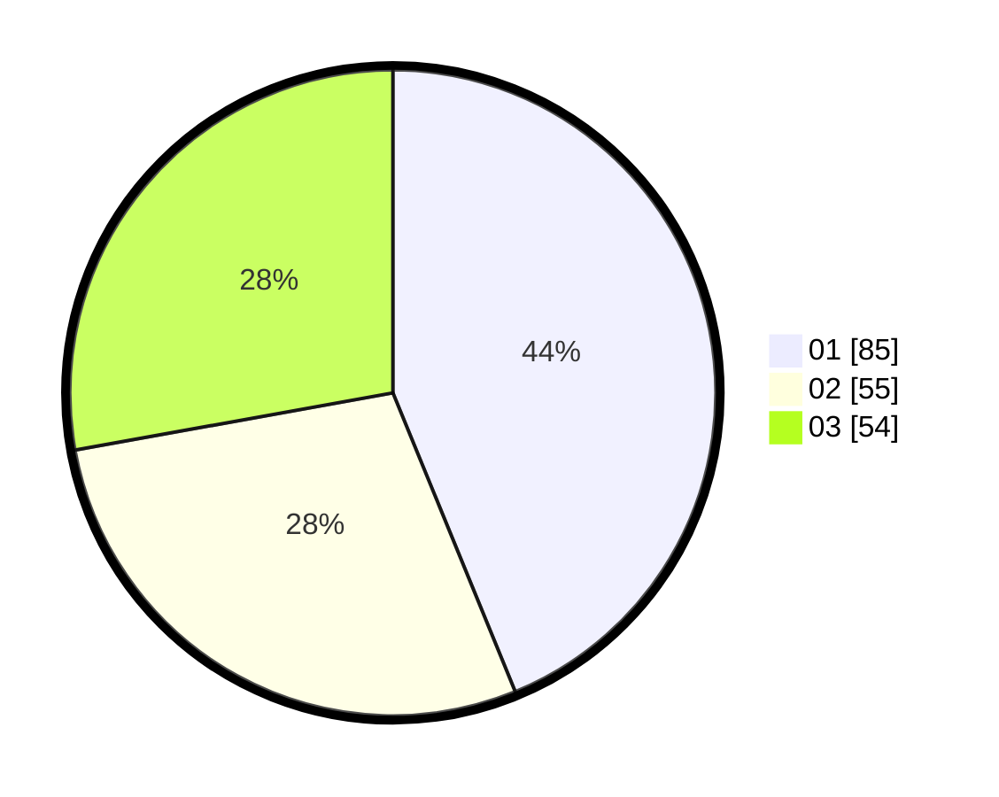

# Hasil

Hasil perolehan suara paslon dapat dilihat pada file paslon-01.txt, paslon-02.txt, dan paslon-03.txt.

Jika tidak ada, artinya data tersebut belum ada pada SIREKAP.

## Perolehan Suara

 * Paslon 01: **85**.
 * Paslon 02: **55**.
 * Paslon 03: **54**.

## Foto C Plano

https://sirekap-obj-formc.kpu.go.id/2053/pemilu/ppwp/31/73/02/10/01/3173021001014-20240216-091648--492eefd4-e8e8-4b3c-bd09-f827b147134f.jpg

https://sirekap-obj-formc.kpu.go.id/2053/pemilu/ppwp/31/73/02/10/01/3173021001014-20240214-194915--a45ee928-ad88-4f26-bfd6-11cd0f60af19.jpg

https://sirekap-obj-formc.kpu.go.id/2053/pemilu/ppwp/31/73/02/10/01/3173021001014-20240214-194940--04598471-4a3e-44d9-b001-6702cbfc153a.jpg

## DATA PEMILIH TETAP

Jumlah pemilih dalam DPT: **235**.
 * L: **108**.
 * P: **127**.

## DATA PENGGUNA HAK PILIH

Jumlah pengguna hak pilih dalam DPT: **183**.
 * L: **81**.
 * P: **102**.

Jumlah pengguna hak pilih dalam DPTb: **15**.
 * L: **6**.
 * P: **9**.

Jumlah pengguna hak pilih dalam DPK: **1**.
 * L: **1**.
 * P: **0**.

Jumlah pengguna hak pilih: **199**.
 * L: **88**.
 * P: **111**.

## JUMLAH SUARA SAH DAN TIDAK SAH

JUMLAH SELURUH SUARA SAH: **194**.

JUMLAH SUARA TIDAK SAH: **5**.

JUMLAH SELURUH SUARA SAH DAN SUARA TIDAK SAH: **199**.
