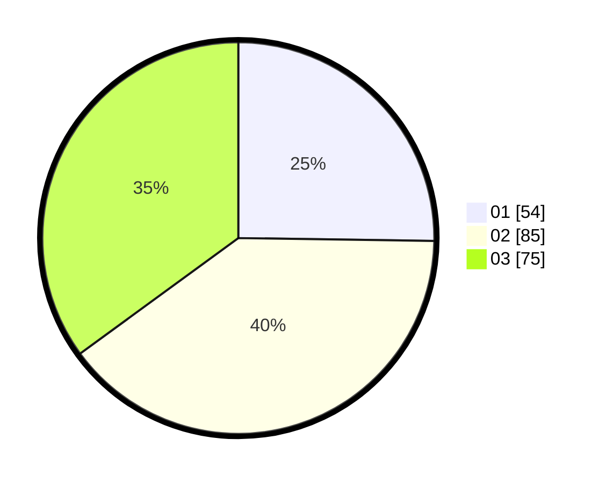

# Hasil

Hasil perolehan suara paslon dapat dilihat pada file paslon-01.txt, paslon-02.txt, dan paslon-03.txt.

Jika tidak ada, artinya data tersebut belum ada pada SIREKAP.

## Perolehan Suara

 * Paslon 01: **54**.
 * Paslon 02: **85**.
 * Paslon 03: **75**.

## Foto C Plano

https://sirekap-obj-formc.kpu.go.id/ce8f/pemilu/ppwp/31/73/02/10/01/3173021001015-20240217-082948--c34051d1-c1ec-45cf-8cbd-acf6d131b595.jpg

https://sirekap-obj-formc.kpu.go.id/ce8f/pemilu/ppwp/31/73/02/10/01/3173021001015-20240214-235450--913ffd4f-a7c1-4127-a537-1e4d65fbd379.jpg

https://sirekap-obj-formc.kpu.go.id/ce8f/pemilu/ppwp/31/73/02/10/01/3173021001015-20240214-235728--98a5144c-e8b8-4030-8b5c-a917e1645dbd.jpg

## DATA PEMILIH TETAP

Jumlah pemilih dalam DPT: **241**.
 * L: **115**.
 * P: **126**.

## DATA PENGGUNA HAK PILIH

Jumlah pengguna hak pilih dalam DPT: **191**.
 * L: **91**.
 * P: **100**.

Jumlah pengguna hak pilih dalam DPTb: **19**.
 * L: **7**.
 * P: **12**.

Jumlah pengguna hak pilih dalam DPK: **8**.
 * L: **2**.
 * P: **6**.

Jumlah pengguna hak pilih: **218**.
 * L: **100**.
 * P: **118**.

## JUMLAH SUARA SAH DAN TIDAK SAH

JUMLAH SELURUH SUARA SAH: **214**.

JUMLAH SUARA TIDAK SAH: **4**.

JUMLAH SELURUH SUARA SAH DAN SUARA TIDAK SAH: **218**.
