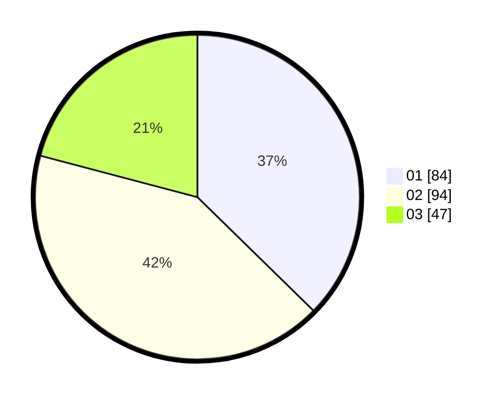

# Hasil

Hasil perolehan suara paslon dapat dilihat pada file paslon-01.txt, paslon-02.txt, dan paslon-03.txt.

Jika tidak ada, artinya data tersebut belum ada pada SIREKAP.

## Perolehan Suara

 * Paslon 01: **84**.
 * Paslon 02: **94**.
 * Paslon 03: **47**.

## Foto C Plano

https://sirekap-obj-formc.kpu.go.id/bdbc/pemilu/ppwp/31/73/02/10/01/3173021001016-20240214-203548--c5caa3ff-e707-4932-901b-1717c81556da.jpg

https://sirekap-obj-formc.kpu.go.id/bdbc/pemilu/ppwp/31/73/02/10/01/3173021001016-20240214-203712--fc6e1089-8233-47d6-9943-d2959f13849f.jpg

https://sirekap-obj-formc.kpu.go.id/bdbc/pemilu/ppwp/31/73/02/10/01/3173021001016-20240214-215434--c695797a-ca5a-40d0-b619-63a9deda2cee.jpg

## DATA PEMILIH TETAP

Jumlah pemilih dalam DPT: **291**.
 * L: **150**.
 * P: **141**.

## DATA PENGGUNA HAK PILIH

Jumlah pengguna hak pilih dalam DPT: **208**.
 * L: **97**.
 * P: **111**.

Jumlah pengguna hak pilih dalam DPTb: **22**.
 * L: **5**.
 * P: **17**.

Jumlah pengguna hak pilih dalam DPK: **1**.
 * L: **1**.
 * P: **0**.

Jumlah pengguna hak pilih: **231**.
 * L: **103**.
 * P: **128**.

## JUMLAH SUARA SAH DAN TIDAK SAH

JUMLAH SELURUH SUARA SAH: **224**.

JUMLAH SUARA TIDAK SAH: **7**.

JUMLAH SELURUH SUARA SAH DAN SUARA TIDAK SAH: **231**.
