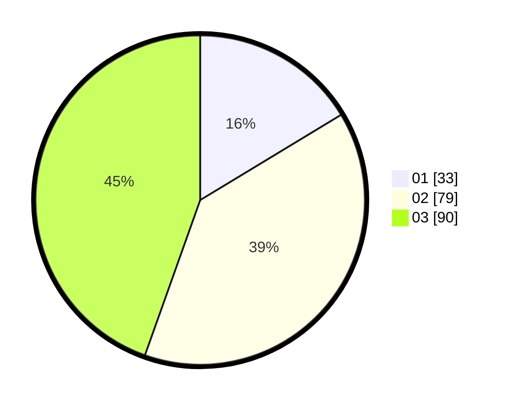

# Hasil

Hasil perolehan suara paslon dapat dilihat pada file paslon-01.txt, paslon-02.txt, dan paslon-03.txt.

Jika tidak ada, artinya data tersebut belum ada pada SIREKAP.

## Perolehan Suara

 * Paslon 01: **33**.
 * Paslon 02: **79**.
 * Paslon 03: **90**.

## Foto C Plano

https://sirekap-obj-formc.kpu.go.id/8e9b/pemilu/ppwp/31/73/02/10/01/3173021001020-20240214-194616--c24397dd-b1a0-49a1-8671-0f0a191241fb.jpg

https://sirekap-obj-formc.kpu.go.id/8e9b/pemilu/ppwp/31/73/02/10/01/3173021001020-20240214-194649--823e8254-b56b-41e0-9c57-6afa52f65707.jpg

https://sirekap-obj-formc.kpu.go.id/8e9b/pemilu/ppwp/31/73/02/10/01/3173021001020-20240214-194734--92e6fd05-4c22-423a-93a7-f22496a71f90.jpg

## DATA PEMILIH TETAP

Jumlah pemilih dalam DPT: **234**.
 * L: **114**.
 * P: **120**.

## DATA PENGGUNA HAK PILIH

Jumlah pengguna hak pilih dalam DPT: **177**.
 * L: **88**.
 * P: **89**.

Jumlah pengguna hak pilih dalam DPTb: **22**.
 * L: **7**.
 * P: **15**.

Jumlah pengguna hak pilih dalam DPK: **3**.
 * L: **0**.
 * P: **3**.

Jumlah pengguna hak pilih: **202**.
 * L: **95**.
 * P: **107**.

## JUMLAH SUARA SAH DAN TIDAK SAH

JUMLAH SELURUH SUARA SAH: **202**.

JUMLAH SUARA TIDAK SAH: **0**.

JUMLAH SELURUH SUARA SAH DAN SUARA TIDAK SAH: **202**.
