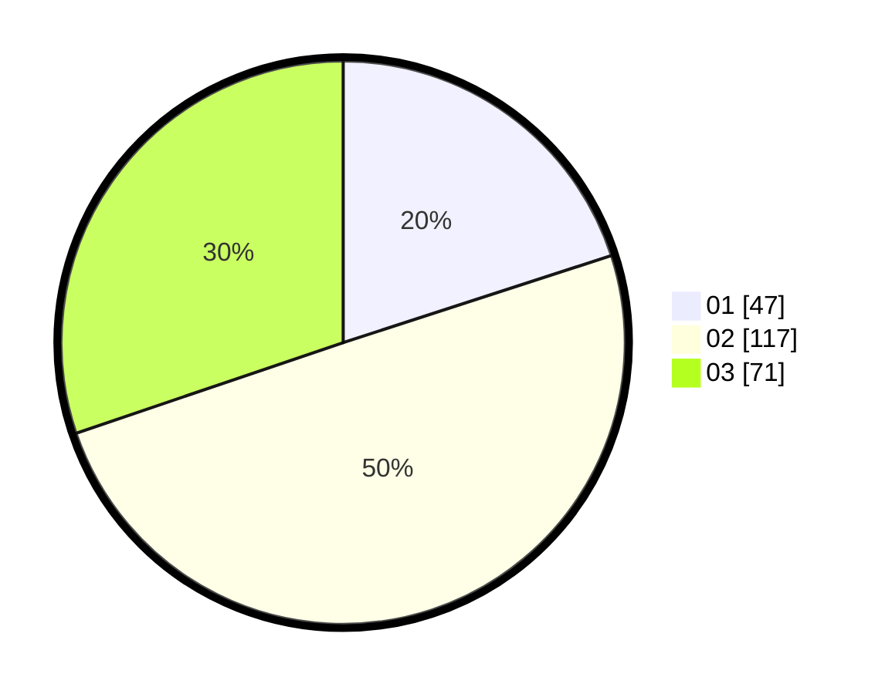

# Hasil

Hasil perolehan suara paslon dapat dilihat pada file paslon-01.txt, paslon-02.txt, dan paslon-03.txt.

Jika tidak ada, artinya data tersebut belum ada pada SIREKAP.

## Perolehan Suara

 * Paslon 01: **47**.
 * Paslon 02: **117**.
 * Paslon 03: **71**.

## Foto C Plano

https://sirekap-obj-formc.kpu.go.id/b41e/pemilu/ppwp/31/73/02/10/01/3173021001022-20240214-194014--06ffe76e-c6a4-4c4e-8565-356dc415725e.jpg

https://sirekap-obj-formc.kpu.go.id/b41e/pemilu/ppwp/31/73/02/10/01/3173021001022-20240214-194140--e5d956da-0df6-4014-9570-2dddb1b0578e.jpg

https://sirekap-obj-formc.kpu.go.id/b41e/pemilu/ppwp/31/73/02/10/01/3173021001022-20240214-194247--49bf1530-82bd-4b8e-8eb8-b1bcb0b46550.jpg
