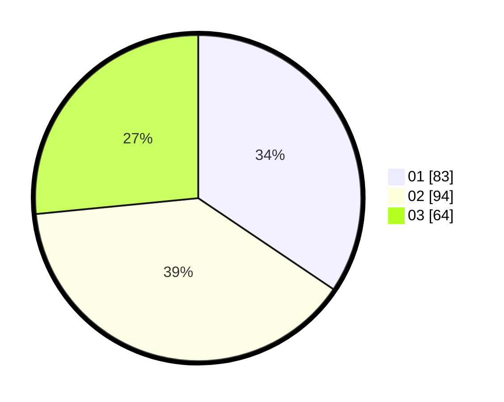

# Hasil

Hasil perolehan suara paslon dapat dilihat pada file paslon-01.txt, paslon-02.txt, dan paslon-03.txt.

Jika tidak ada, artinya data tersebut belum ada pada SIREKAP.

## Perolehan Suara

 * Paslon 01: **83**.
 * Paslon 02: **94**.
 * Paslon 03: **64**.

## Foto C Plano

https://sirekap-obj-formc.kpu.go.id/3d32/pemilu/ppwp/31/73/02/10/01/3173021001023-20240214-185019--31ddbe2c-7e91-4118-9fb4-75b71069ebb0.jpg

https://sirekap-obj-formc.kpu.go.id/3d32/pemilu/ppwp/31/73/02/10/01/3173021001023-20240214-185104--1134f85c-9ca2-4453-ac9f-cbd16e7e81df.jpg

https://sirekap-obj-formc.kpu.go.id/3d32/pemilu/ppwp/31/73/02/10/01/3173021001023-20240214-185140--2ed910e7-0c24-48b6-a1e7-be8a20151c50.jpg
