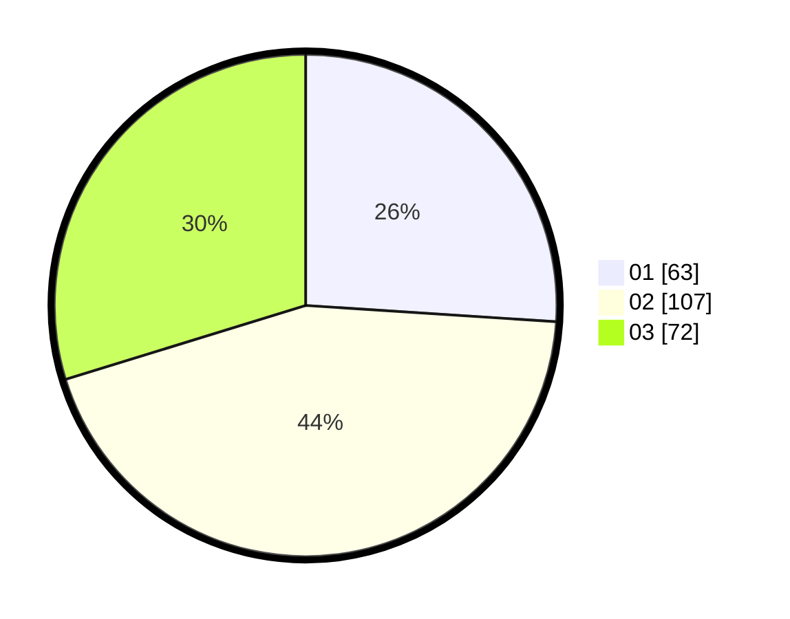

# Hasil

Hasil perolehan suara paslon dapat dilihat pada file paslon-01.txt, paslon-02.txt, dan paslon-03.txt.

Jika tidak ada, artinya data tersebut belum ada pada SIREKAP.

## Perolehan Suara

 * Paslon 01: **63**.
 * Paslon 02: **107**.
 * Paslon 03: **72**.

## Foto C Plano

https://sirekap-obj-formc.kpu.go.id/ac01/pemilu/ppwp/31/73/02/10/01/3173021001024-20240214-202439--074fa66b-eabb-4b3a-a18c-d26df53434f4.jpg

https://sirekap-obj-formc.kpu.go.id/ac01/pemilu/ppwp/31/73/02/10/01/3173021001024-20240214-202443--1784094a-9f5a-40b7-8127-262573bb9873.jpg

https://sirekap-obj-formc.kpu.go.id/ac01/pemilu/ppwp/31/73/02/10/01/3173021001024-20240214-202446--7955df06-4be6-4a44-a5c2-aeb27136786c.jpg
