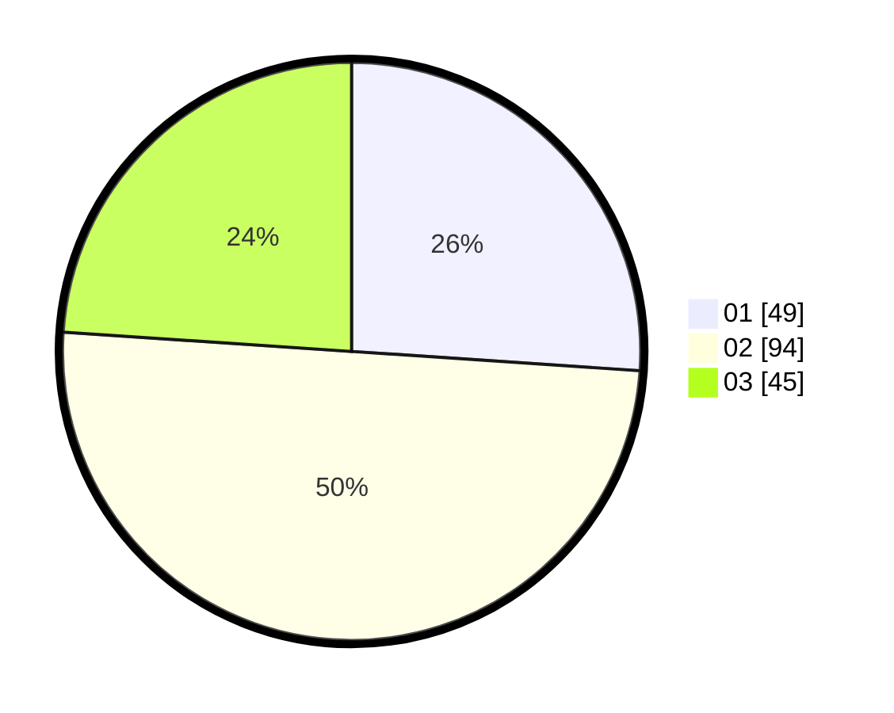

# Hasil

Hasil perolehan suara paslon dapat dilihat pada file paslon-01.txt, paslon-02.txt, dan paslon-03.txt.

Jika tidak ada, artinya data tersebut belum ada pada SIREKAP.

## Perolehan Suara

 * Paslon 01: **49**.
 * Paslon 02: **94**.
 * Paslon 03: **45**.

## Foto C Plano

https://sirekap-obj-formc.kpu.go.id/8f58/pemilu/ppwp/31/73/02/10/01/3173021001026-20240215-102029--b3b1ead0-58d1-4b81-a00c-3a83075e5e5c.jpg

https://sirekap-obj-formc.kpu.go.id/8f58/pemilu/ppwp/31/73/02/10/01/3173021001026-20240215-102135--396ca348-1524-4837-b5f1-efa65fd2b99f.jpg

https://sirekap-obj-formc.kpu.go.id/8f58/pemilu/ppwp/31/73/02/10/01/3173021001026-20240215-102257--26abaa5c-3915-4bb9-a023-4655bc9582d8.jpg
